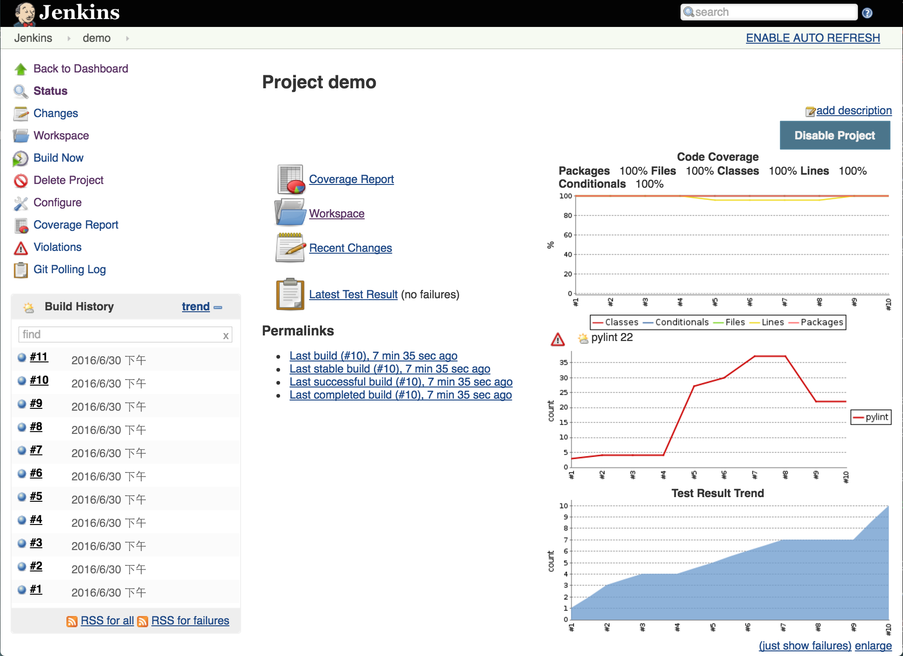
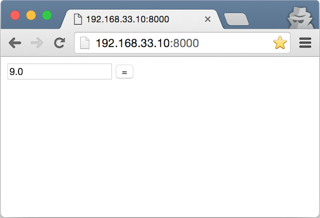

# Demo of BDD/TDD/CI on Django

## 前言

本來想用網站帳號註冊與登入來示範 TDD/BDD，但是
- 帳號檢查的邏輯太簡單，很難示範 TDD
- Behave-django 做得太好了，Model 根本不需要 mock

要找出一個範例會複雜到需要拆成 features, steps, interfaces, implementation of [SUT](http://xunitpatterns.com/SUT.html), 還有要切割依賴的 [DOC](http://xunitpatterns.com/DOC.html)，同時又必須簡單到範例可以塞進一張投影片。幾經考量，轉而想使用解析字串的計算機(類似工程用計算機)做範例。

計算機須滿足 [四則運算規則](https://zh.wikipedia.org/wiki/%E5%9B%9B%E5%88%99%E8%BF%90%E7%AE%97)
- 由左而右計算
- 先括號，再× ÷，後 + −（先乘除後加減）
- 先算內括號，再算外括號
- [運算子優先順序](https://zh.wikipedia.org/wiki/%E9%81%8B%E7%AE%97%E6%AC%A1%E5%BA%8F)
- [加法交換律](https://zh.wikipedia.org/wiki/%E4%BA%A4%E6%8F%9B%E5%BE%8B): "3 + 4 = 4 + 3"
- [加法結合律](https://zh.wikipedia.org/wiki/%E7%BB%93%E5%90%88%E5%BE%8B): "(5+2) + 1 = 5 + (2+1) = 8"
- [乘法交換律](https://zh.wikipedia.org/wiki/%E4%BA%A4%E6%8F%9B%E5%BE%8B): "2 × 5 = 5 × 2"
- [乘法結合律](https://zh.wikipedia.org/wiki/%E7%BB%93%E5%90%88%E5%BE%8B): "(5x2) x 3 = 5 x (2x3) = 30"
- [乘法分配律](https://zh.wikipedia.org/wiki/%E5%88%86%E9%85%8D%E5%BE%8B): "2 x(1+3) = (2x1) + (2x3)"

## 設定環境

```shell
vagrant@debian:~$ cd myWorkspace/venv/
$ source venv/bin/activate
(venv) vagrant@debian:~/myWorkspace$
```
- 以下範例省略提示符號`$`前所有文字

### 安裝 Djando 專案

```shell
$ django-admin startproject demo
$ tree demo/
demo/
├── demo
│   ├── __init__.py
│   ├── settings.py
│   ├── urls.py
│   └── wsgi.py
└── manage.py
$ cd demo
```

### 建立 Calculator App

```shell
$ python manage.py startapp calc
$ tree calc
calc
├── admin.py
├── apps.py
├── __init__.py
├── migrations
│   └── __init__.py
├── models.py
├── tests.py
└── views.py
```

### 新增 Calculator App

修改 demo/settings.py
```python
INSTALLED_APPS = [
    'behave_django',
    ...
]
```

## 藉由 BDD 引導，定義特徵與步驟

### 一開始什麼都沒有

先什麼都不做，跑一下 behave 看看發生什麼事情

第一次執行 behave
```shell
$ python manage.py behave
Creating test database for alias 'default'...
ConfigError: No steps directory in "/home/vagrant/myWorkspace/demo/features"
Destroying test database for alias 'default'...
```
- 溫馨提示: 缺少 features/steps 目錄

### 建立 features/steps 目錄

```shell
$ mkdir -p features/steps
```

第二次執行 behave
```shell
$ python manage.py behave
Creating test database for alias 'default'...
ConfigError: No feature files in "/home/vagrant/myWorkspace/demo/features"
Destroying test database for alias 'default'...
```
- 溫馨提示: 還沒有定義特徵 (features)

### 建立 calc 的特徵描述檔

產生檔案 features/calc.feature:
```python
#file: features/calc.feature

Feature: Web calculator

    As a student
    In order to finish my homework
    I want to do arithmatical operations

    Scenario: add two numbers
        Given I enter "1+1"
         When I press "=" button
         Then I get the answer "2"
```

第三次執行 behave
```shell
$ python manage.py behave --dry-run

Feature: Web calculator # features/calc.feature:3
  As a student
  In order to finish my homework
  I want to do arithmatical operations
  Scenario: add two numbers   # features/calc.feature:9
    Given I enter "3+2"       # None
    When I press "=" button   # None
    Then I get the answer "5" # None

0 features passed, 0 failed, 0 skipped, 1 untested
0 scenarios passed, 0 failed, 0 skipped, 1 untested
0 steps passed, 0 failed, 0 skipped, 3 undefined
Took 0m0.000s

You can implement step definitions for undefined steps with these snippets:

@given(u'I enter "3+2"')
def step_impl(context):
    raise NotImplementedError(u'STEP: Given I enter "3+2"')

@when(u'I press "=" button')
def step_impl(context):
    raise NotImplementedError(u'STEP: When I press "=" button')

@then(u'I get the answer "5"')
def step_impl(context):
    raise NotImplementedError(u'STEP: Then I get the answer "5"')
```
- 溫馨提示: 還沒有定義步驟 (steps)，這些 snippets 可以拿去用

### 建立 calc 的步驟定義檔

產生檔案 features/steps/calc.py:
```python
@given(u'I enter "3+2"')
def step_impl(context):
    raise NotImplementedError(u'STEP: Given I enter "1+1"')

@when(u'I press "=" button')
def step_impl(context):
    raise NotImplementedError(u'STEP: When I press "=" button')

@then(u'I get the answer "5"')
def step_impl(context):
    raise NotImplementedError(u'STEP: Then I get the answer "2"')
```

第四次執行 behave
```shell
$ python manage.py behave --dry-run

Feature: Web calculator # features/calc.feature:3
  As a student
  In order to finish my homework
  I want to do arithmatical operations
  Scenario: add two numbers   # features/calc.feature:9
    Given I enter "3+2"       # None
    When I press "=" button   # None
    Then I get the answer "5" # None

0 features passed, 0 failed, 0 skipped, 1 untested
0 scenarios passed, 0 failed, 0 skipped, 1 untested
0 steps passed, 0 failed, 0 skipped, 0 undefined, 3 untested
Took 0m0.000s
```
- 溫馨提示: 一個 feature、一個 scenario、三個 steps 沒有測試

### 再增加一個 scenario

修改 features/calc.feature，增加以下程式片段:
```python
    Scenario: subtract two numbers
        Given I enter "3-2"
         When I press "=" button
         Then I get the answer "1"
```

第五次執行 behave
```shell
$ python manage.py behave --dry-run

Feature: Web calculator # features/calc.feature:3
  As a student
  In order to finish my homework
  I want to do arithmatical operations
  Scenario: add two numbers   # features/calc.feature:9
    Given I enter "3+2"       # None
    When I press "=" button   # None
    Then I get the answer "5" # None

  Scenario: subtract two numbers  # features/calc.feature:14
    Given I enter "3-2"           # None
    When I press "=" button       # None
    Then I get the answer "1"     # None

0 features passed, 0 failed, 0 skipped, 1 untested
0 scenarios passed, 0 failed, 0 skipped, 2 untested
0 steps passed, 0 failed, 0 skipped, 2 undefined, 4 untested
Took 0m0.000s

You can implement step definitions for undefined steps with these snippets:

@given(u'I enter "3-2"')
def step_impl(context):
    raise NotImplementedError(u'STEP: Given I enter "3-2"')

@then(u'I get the answer "1"')
def step_impl(context):
    raise NotImplementedError(u'STEP: Then I get the answer "1"')
```
- 溫馨提示: 有些 features, scenarios, steps 沒有測試；有 steps 沒定義，可使用提供的 snippets

### 修改 calc 的步驟定義檔

修改檔案 features/steps/calc.py，增加以下程式片段:
```python
@given(u'I enter "3-2"')
def step_impl(context):
    raise NotImplementedError(u'STEP: Given I enter "3-2"')

@then(u'I get the answer "1"')
def step_impl(context):
    raise NotImplementedError(u'STEP: Then I get the answer "1"')
```

第六次執行 behave
```shell
$ python manage.py behave --dry-run

Feature: Web calculator # features/calc.feature:3
  As a student
  In order to finish my homework
  I want to do arithmatical operations
  Scenario: add two numbers   # features/calc.feature:9
    Given I enter "3+2"       # None
    When I press "=" button   # None
    Then I get the answer "5" # None

  Scenario: subtract two numbers  # features/calc.feature:14
    Given I enter "3-2"           # None
    When I press "=" button       # None
    Then I get the answer "1"     # None

0 features passed, 0 failed, 0 skipped, 1 untested
0 scenarios passed, 0 failed, 0 skipped, 2 untested
0 steps passed, 0 failed, 0 skipped, 0 undefined, 6 untested
Took 0m0.000s
```
- 溫馨提示: 有些 features, scenarios, steps 沒有測試

### 重構步驟定義檔 - 使用變數

修改檔案 features/steps/calc.py
```python
@given(u'I enter {expr}')
def step_impl(context, expr):
    raise NotImplementedError(u'STEP: Given I enter {expr}')

@when(u'I press "=" button')
def step_impl(context):
    raise NotImplementedError(u'STEP: When I press "=" button')

@then(u'I get the answer {answer}')
def step_impl(context, answer):
    raise NotImplementedError(u'STEP: Then I get the answer {answer}')
```

第七次執行 behave
```shell
$ python manage.py behave --dry-run

Feature: Web calculator # features/calc.feature:3
  As a student
  In order to finish my homework
  I want to do arithmatical operations
  Scenario: add two numbers   # features/calc.feature:9
    Given I enter "3+2"       # None
    When I press "=" button   # None
    Then I get the answer "5" # None

  Scenario: subtract two numbers  # features/calc.feature:14
    Given I enter "3-2"           # None
    When I press "=" button       # None
    Then I get the answer "1"     # None

0 features passed, 0 failed, 0 skipped, 1 untested
0 scenarios passed, 0 failed, 0 skipped, 2 untested
0 steps passed, 0 failed, 0 skipped, 0 undefined, 6 untested
Took 0m0.000s
```
- 步驟檔使用變數，定義一個 step 能適用多個 scenarios

### 重構特徵描述檔 - 合併場景

修改 features/calc.feature，使用 `Scenario Outline` 合併加法、減法場景，並增加更多場景與錯誤處理
```python
    Scenario Outline: do simple operations
        Given I enter <expression>
         When I press "=" button
         Then I get the answer <answer>

        Examples:
            | expression    | answer        |
            | 3 + 2         | 5             |
            | 3 - 2         | 1             |
            | 3 * 2         | 6             |
            | 3 / 2         | 1.5           |
            | 3 +-*/        | Invalid Input |
            | hello world   | Invalid Input |
```

第八次執行 behave
```shell
$ python manage.py behave --dry-run

Feature: Web calculator # features/calc.feature:3
  As a student
  In order to finish my homework
  I want to do arithmatical operations
  Scenario Outline: do simple operations -- @1.1   # features/calc.feature:16
    Given I enter 3 + 2                            # None
    When I press "=" button                        # None
    Then I get the answer 5                        # None

  Scenario Outline: do simple operations -- @1.2   # features/calc.feature:17
    Given I enter 3 - 2                            # None
    When I press "=" button                        # None
    Then I get the answer 1                        # None

  Scenario Outline: do simple operations -- @1.3   # features/calc.feature:18
    Given I enter 3 * 2                            # None
    When I press "=" button                        # None
    Then I get the answer 6                        # None

  Scenario Outline: do simple operations -- @1.4   # features/calc.feature:19
    Given I enter 3 / 2                            # None
    When I press "=" button                        # None
    Then I get the answer 1.5                      # None

  Scenario Outline: do simple operations -- @1.5   # features/calc.feature:20
    Given I enter 3 +-*/ 2                         # None
    When I press "=" button                        # None
    Then I get the answer Invalid Input            # None

  Scenario Outline: do simple operations -- @1.6   # features/calc.feature:21
    Given I enter hello world                      # None
    When I press "=" button                        # None
    Then I get the answer Invalid Input            # None

0 features passed, 0 failed, 0 skipped, 1 untested
0 scenarios passed, 0 failed, 0 skipped, 6 untested
0 steps passed, 0 failed, 0 skipped, 0 undefined, 18 untested
Took 0m0.000s
```
- 溫馨提示: 更多 features, scenarios, steps 沒有測試

### 增加更多特徵

修改 features/calc.feature，使特徵滿足
[加法/乘法交換律](https://zh.wikipedia.org/wiki/%E4%BA%A4%E6%8F%9B%E5%BE%8B)、[加法/乘法結合律](https://zh.wikipedia.org/wiki/%E7%BB%93%E5%90%88%E5%BE%8B)、、[乘法分配律](https://zh.wikipedia.org/wiki/%E5%88%86%E9%85%8D%E5%BE%8B)
```python
    Scenario Outline: satisfy commutative property
         When I enter <expression1> first
          And I enter <expression2> again
         Then I get the same answer

        Examples:
            | expression1   | expression2   |
            | 3 + 4         | 4 + 3         |
            | 2 * 5         | 5 * 2         |

    Scenario Outline: satisfy associative property
         When I enter <expression1> first
          And I enter <expression2> again
         Then I get the same answer

        Examples:
            | expression1   | expression2   |
            | (2 + 3) + 4   | 2 + (3 + 4)   |
            | 2 * (3 * 4)   | (2 * 3) * 4   |

    Scenario Outline: satisfy distributive property
         When I enter <expression1> first
          And I enter <expression2> again
         Then I get the same answer

        Examples:
            | expression1   | expression2   |
            | 2 * (1 + 3)   | (2*1) + (2*3) |
            | (1 + 3) * 2   | (1*2) + (3*2) |
```

第九次執行 behave
```shell
$ python manage.py behave --dry-run

Feature: Web calculator # features/calc.feature:3
  As a student
  In order to finish my homework
  I want to do arithmatical operations
  Scenario Outline: do simple operations -- @1.1   # features/calc.feature:16
    Given I enter 3 + 2                            # None
    When I press "=" button                        # None
    Then I get the answer 5                        # None

  ...(略)

0 features passed, 0 failed, 0 skipped, 1 untested
0 scenarios passed, 0 failed, 0 skipped, 11 untested
0 steps passed, 0 failed, 0 skipped, 15 undefined, 18 untested
Took 0m0.000s

You can implement step definitions for undefined steps with these snippets:

@when(u'I enter 3 + 4 first')
def step_impl(context):
    raise NotImplementedError(u'STEP: When I enter 3 + 4 first')

@when(u'I enter 4 + 3 again')
def step_impl(context):
    raise NotImplementedError(u'STEP: When I enter 4 + 3 again')

@then(u'I get the same answer')
def step_impl(context):
    raise NotImplementedError(u'STEP: Then I get the same answer')

@when(u'I enter 2 * 5 first')
def step_impl(context):
    raise NotImplementedError(u'STEP: When I enter 2 * 5 first')

@when(u'I enter 5 * 2 again')
def step_impl(context):
    raise NotImplementedError(u'STEP: When I enter 5 * 2 again')

@when(u'I enter (2 + 3) + 4 first')
def step_impl(context):
    raise NotImplementedError(u'STEP: When I enter (2 + 3) + 4 first')

@when(u'I enter 2 + (3 + 4) again')
def step_impl(context):
    raise NotImplementedError(u'STEP: When I enter 2 + (3 + 4) again')

@when(u'I enter 2 * (3 * 4) first')
def step_impl(context):
    raise NotImplementedError(u'STEP: When I enter 2 * (3 * 4) first')

@when(u'I enter (2 * 3) * 4 again')
def step_impl(context):
    raise NotImplementedError(u'STEP: When I enter (2 * 3) * 4 again')

@when(u'I enter 2 * (1 + 3) first')
def step_impl(context):
    raise NotImplementedError(u'STEP: When I enter 2 * (1 + 3) first')

@when(u'I enter (2*1) + (2*3) again')
def step_impl(context):
    raise NotImplementedError(u'STEP: When I enter (2*1) + (2*3) again')

@when(u'I enter (1 + 3) * 2 first')
def step_impl(context):
    raise NotImplementedError(u'STEP: When I enter (1 + 3) * 2 first')

@when(u'I enter (1*2) + (3*2) again')
def step_impl(context):
    raise NotImplementedError(u'STEP: When I enter (1*2) + (3*2) again')
```

### 增加步驟

```python
@when(u'I enter {expr1} first')
def step_impl(context, expr1):
    raise NotImplementedError(u'STEP: When I enter {expr} first')

@when(u'I enter {expr2} again')
def step_impl(context, expr2):
    raise NotImplementedError(u'STEP: When I enter {expr2} again')

@then(u'I get the same answer')
def step_impl(context):
    raise NotImplementedError(u'STEP: Then I get the same answer')
```

第十次執行 behave，這次不用 `--dry-run` 參數
```shell
$ python manage.py behave

Creating test database for alias 'default'...
Feature: Web calculator # features/calc.feature:3
  As a student
  In order to finish my homework
  I want to do arithmatical operations
  Scenario Outline: do simple operations -- @1.1   # features/calc.feature:16
    Given I enter 3 + 2                            # features/steps/calc.py:1 0.000s
      Traceback (most recent call last):
        File "/home/vagrant/myWorkspace/venv/lib/python3.5/site-packages/behave/model.py", line 1456, in run
          match.run(runner.context)
        File "/home/vagrant/myWorkspace/venv/lib/python3.5/site-packages/behave/model.py", line 1903, in run
          self.func(context, *args, **kwargs)
        File "/home/vagrant/.pyenv/versions/3.5.1/lib/python3.5/contextlib.py", line 77, in __exit__
          self.gen.throw(type, value, traceback)
        File "/home/vagrant/myWorkspace/venv/lib/python3.5/site-packages/behave/runner.py", line 162, in user_mode
          yield
        File "/home/vagrant/myWorkspace/venv/lib/python3.5/site-packages/behave/model.py", line 1903, in run
          self.func(context, *args, **kwargs)
        File "features/steps/calc.py", line 3, in step_impl
          raise NotImplementedError(u'STEP: Given I enter {expr}')
      NotImplementedError: STEP: Given I enter {expr}

    When I press "=" button                        # None
    Then I get the answer 5                        # None

...(略)

Failing scenarios:
  features/calc.feature:16  do simple operations -- @1.1
  features/calc.feature:17  do simple operations -- @1.2
  features/calc.feature:18  do simple operations -- @1.3
  features/calc.feature:19  do simple operations -- @1.4
  features/calc.feature:20  do simple operations -- @1.5
  features/calc.feature:21  do simple operations -- @1.6
  features/calc.feature:30  satisfy commutative property -- @1.1
  features/calc.feature:31  satisfy commutative property -- @1.2
  features/calc.feature:40  satisfy associative property -- @1.1
  features/calc.feature:41  satisfy associative property -- @1.2
  features/calc.feature:50  satisfy distributive property -- @1.1

0 features passed, 1 failed, 0 skipped
0 scenarios passed, 11 failed, 0 skipped
0 steps passed, 11 failed, 22 skipped, 0 undefined
Took 0m0.003s
Destroying test database for alias 'default'...
```
- 溫馨提示: 一堆 features, scenarios, steps 失敗

### 重構特徵描述檔 - 移除 `NotImplementedError`

```python
from cala.calculator import Calculator

@given(u'I enter {expr}')
def step_impl(context, expr):
    context.expr = expr

@when(u'I press "=" button')
def step_impl(context):
    calc = Calculator()
    context.answer = calc.evalString(context.expr)

@then(u'I get the answer {answer}')
def step_impl(context, answer):
    try:
        ans = float(answer)
    except ValueError:
        ans = answer

    assert context.answer == ans

@when(u'I enter {expr1} first')
def step_impl(context, expr1):
    calc = Calculator()
    context.answer1 = calc.evalString(expr1)

@when(u'I enter {expr2} again')
def step_impl(context, expr2):
    calc = Calculator()
    context.answer2 = calc.evalString(expr2)

@then(u'I get the same answer')
def step_impl(context):
    assert context.answer1 == context.answer2
```

第十一次執行 behave
```shell
$ python manage.py behave

Creating test database for alias 'default'...
Exception ImportError: No module named 'calc.calculator'; 'calc' is not a package
Traceback (most recent call last):
  ...(略)
  File "/home/vagrant/myWorkspace/demo/features/steps/calc.py", line 1, in <module>
    from calc.calculator import Calculator
ImportError: No module named 'calc.calculator'; 'calc' is not a package
```
- 溫馨提示: No module named 'calc.calculator'; 'calc' is not a package

### 修改專案設定

修改 demo/settings.py，增加 `calc` App
```python
INSTALLED_APPS = [
    ...
    'calc',
]
```

第十二次執行 behave
```shell
$ python manage.py behave

Creating test database for alias 'default'...
Exception ImportError: No module named 'calc.calculator'
Traceback (most recent call last):
  ...(略)
  File "features/steps/calc.py", line 1, in <module>
    from calc.calculator import Calculator
ImportError: No module named 'calc.calculator'
```
- 溫馨提示: No module named 'calc.calculator'

### 增加模組 calc

```shell
$ touch calc/calculator.py
```

第十三次執行 behave
```shell
$ python manage.py behave

Creating test database for alias 'default'...
Exception ImportError: cannot import name 'Calculator'
Traceback (most recent call last):
  ...(略)
  File "features/steps/calc.py", line 1, in <module>
    from calc.calculator import Calculator
ImportError: cannot import name 'Calculator'
```
- 溫馨提示: cannot import name 'Calculator'

### 增加 `Calculator` 類別

修改 calc/calculator.py，增加 `Calculator` 類別，並提供 `evalString` 方法
```python
class Calculator:

    def evalString(self, string):
        return 0
```

第十四次執行 behave
```shell
$ python manage.py behave

Creating test database for alias 'default'...
Feature: Web calculator # features/calc.feature:3
  As a student
  In order to finish my homework
  I want to do arithmatical operations
  Scenario Outline: do simple operations -- @1.1   # features/calc.feature:16
    Given I enter 3 + 2                            # features/steps/calc.py:3 0.000s
    When I press "=" button                        # features/steps/calc.py:7 0.000s
    Then I get the answer 5                        # features/steps/calc.py:12 0.000s
      Traceback (most recent call last):
        File "/home/vagrant/myWorkspace/venv/lib/python3.5/site-packages/behave/model.py", line 1456, in run
          match.run(runner.context)
        File "/home/vagrant/myWorkspace/venv/lib/python3.5/site-packages/behave/model.py", line 1903, in run
          self.func(context, *args, **kwargs)
        File "features/steps/calc.py", line 19, in step_impl
          assert context.answer == ans
      AssertionError

...(略)

Failing scenarios:
  features/calc.feature:16  do simple operations -- @1.1
  features/calc.feature:17  do simple operations -- @1.2
  features/calc.feature:18  do simple operations -- @1.3
  features/calc.feature:19  do simple operations -- @1.4
  features/calc.feature:20  do simple operations -- @1.5
  features/calc.feature:21  do simple operations -- @1.6

0 features passed, 1 failed, 0 skipped
5 scenarios passed, 6 failed, 0 skipped
27 steps passed, 6 failed, 0 skipped, 0 undefined
Took 0m0.005s
Destroying test database for alias 'default'...
```
- 溫馨提示: 有些成功、有些失敗 (因為還沒實作功能)
- 可以開始實作 `Calculator` 了

## 藉由 TDD 引導，實作底層功能

開始開發 `Calculator` 功能之前，先把剛剛的程式碼放到 git repository
```shell
$ git init
```

新增 .gitignore 檔案，避免某些檔案加入 git repository
```
__pycache__
db.sqlite3
.python-version
*.pyc
.*.swp
reports/
```

```shell
$ git add .
$ git commit -m "init project"
```

### 新增第一個測試案例

修改 calc/tests.py
```python
from django.test import TestCase
from calc.calculator import Calculator

# Create your tests here.
class TestCalculator(TestCase):

    def setUp(self):
        self.calc = Calculator()

    def test_evalString(self):
        evalString = self.calc.evalString
        self.assertEqual(evalString('0'), 0)
```

執行 unittest
```shell
$ python manage.py test -v2
Creating test database for alias 'default' ('file:memorydb_default?mode=memory&cache=shared')...
Operations to perform:
  Synchronize unmigrated apps: behave_django, messages, django_jenkins, staticfiles
  Apply all migrations: sessions, admin, auth, contenttypes
Synchronizing apps without migrations:
  Creating tables...
    Running deferred SQL...
Running migrations:
  ...(略)
test_evalString (calc.tests.TestCalculator) ... ok

----------------------------------------------------------------------
Ran 1 test in 0.002s

OK
Destroying test database for alias 'default' ('file:memorydb_default?mode=memory&cache=shared')...
```
- 溫馨提示: 剛剛最簡單的測試 `test_evalString` 通過

把通過測試的程式碼與測試程式碼放上 git repository
```shell
$ git add .
$ git commit -m "add test_evalString"
```

### 再多一點點測試

修改 calc/tests.py
```python
    def test_evalString(self):
        evalString = self.calc.evalString
        self.assertEqual(evalString('0'), 0)
        self.assertEqual(evalString('1'), 1)
```

執行 unittest
```shell
$ python manage.py test -v2
...（略)

test_evalString (calc.tests.TestCalculator) ... FAIL

======================================================================
FAIL: test_evalString (calc.tests.TestCalculator)
----------------------------------------------------------------------
Traceback (most recent call last):
  File "/home/vagrant/myWorkspace/demo/calc/tests.py", line 13, in test_evalString
    self.assertEqual(evalString('1'), 1)
AssertionError: 0 != 1

----------------------------------------------------------------------
Ran 1 test in 0.002s

FAILED (failures=1)
```
- 溫馨提示: `test_evalString` 測試失敗，快去修改 `Calculator`

### 插播 pyparsing

接下來會使用 pyparsing 來解析輸入字串，把字串變成“數字”與“運算符號”，然後根據運算符號執行正確的計算。

例如，輸入 `3+2`，解析字串後得到 `exprStack=['3', '2', '+']`，從 `exprStack` 取出 (pop) 元素 `+`，因為 `+` 是運算符號，要再取出兩個運算元 `2` 與 `3` (依照取出順序)，然後呼叫 `+` 符號對應的函數 `add(3, 2)`，最後得答案 `5`。

> 細節請參考 pyparsing [說明](pyparsing.md)與[範例](pyparsing_exercise.md)

### 修改 `Calculator` - 增加解析字串能力

修改 calc/tests.py，增加 `parseString` 測試
```python
    def test_parseString(self):
        parseString = self.calc.parseString
        self.assertEqual(parseString('0'), ['0'])
        self.assertEqual(parseString('1'), ['1'])
```

執行 unittest
```shell
$ python manage.py test
...(略)
======================================================================
ERROR: test_parseString (calc.tests.TestCalculator)
----------------------------------------------------------------------
Traceback (most recent call last):
  File "/home/vagrant/myWorkspace/demo/calc/tests.py", line 11, in test_parseString
    parseString = self.calc.parseString
AttributeError: 'Calculator' object has no attribute 'parseString'
```
- 溫馨提示: 'Calculator' object has no attribute 'parseString'

修改 calc/calculator.py，增加 `parseString` 方法滿足測試
```python
from pyparsing import nums, Word, StringEnd

"""
integer :: '0'...'9'*
expr    :: integer
"""

class Calculator:

    def __init__(self):
        self.exprStack = []

        integer = Word(nums)
        self.expr = integer + StringEnd()

    def parseString(self, string):
        self.exprStack = []
        return self.expr.parseString(string).asList()

    def evalString(self, string):
        return 0
```
- 增加 `parseString` 解析功能

執行 unittest，測試 `parseString` 方法
```shell
$ python manage.py test -v2
...(略)
test_evalString (calc.tests.TestCalculator) ... FAIL
test_parseString (calc.tests.TestCalculator) ... ok
```
- 溫馨提示: `test_parseString` 測試通過，繼續努力

### 修改 `Calculator` - 增加解析 `exprStack` 能力

修改 calc/tests.py，增加 `evalStack` 測試
```python
    def test_evalStack(self):
        evalStack = self.calc.evalStack
        self.assertEqual(evalStack(['0']), 0)
        self.assertEqual(evalStack(['1']), 1)
```

執行 unittest
```shell
$ python manage.py test
...(略)
======================================================================
ERROR: test_evalStack (calc.tests.TestCalculator)
----------------------------------------------------------------------
Traceback (most recent call last):
  File "/home/vagrant/myWorkspace/demo/calc/tests.py", line 16, in test_evalStack
    evalStack = self.calc.evalStack
AttributeError: 'Calculator' object has no attribute 'evalStack'
```
- 溫馨提示: 'Calculator' object has no attribute 'evalStack'

修改 calc/calculator.py，增加 `evalStack` 方法滿足測試
```python
class Calculator:

    def __init__(self):
        self.exprStack = []

        def pushStack(s, l, t):
            self.exprStack.append(t[0])

        integer = Word(nums).addParseAction(pushStack)
        self.expr = integer + StringEnd()

    ...(略)
    
    def evalStack(self, stack):
        op = stack.pop()
        return float(op)
```

執行 unittest，測試 `evalStack` 方法
```shell
$ python manage.py test -v2
...(略)
test_evalStack (calc.tests.TestCalculator) ... ok
test_evalString (calc.tests.TestCalculator) ... FAIL
test_parseString (calc.tests.TestCalculator) ... ok
```
- 溫馨提示: `test_evalStack` 測試通過，快讓 `test_evalString` 通過測試吧

### 修改 `Calculator` - 完善解析字串能力

這次不修改 calc/tests.py，沿用裡面的測試

修改 calc/calculator.py，完善 `parseString` 方法滿足測試
```python
class Calculator:

    def __init__(self):
        ...(略)

    def parseString(self, string):
        ...(略)

    def evalStack(self, stack):
        ...(略)
    
    def evalString(self, string):
        self.parseString(string)
        return self.evalStack(self.exprStack)
```

執行 unittest，測試 `evalString` 方法
```shell
$ python manage.py test -v2
...(略)
test_evalStack (calc.tests.TestCalculator) ... ok
test_evalString (calc.tests.TestCalculator) ... ok
test_parseString (calc.tests.TestCalculator) ... ok
```
- 溫馨提示: `test_evalStack`, `test_evalString`, `test_parseString` 測試通過，先 git commit 吧

```shell
$ git add .
$ git commit -m "test evalStack, evalString, parseString: ok"
```

### 修改 `Calculator` - 增加錯誤處理

修改 calc/tests.py，增加輸入錯誤測試
```python
    def test_invalid_input(self):
        evalString = self.calc.evalString
        self.assertEqual(evalString('hello world'), 'Invalid Input')
```

執行 unittest，測試 `evalString` 方法
```shell
$ python manage.py test
..E.
======================================================================
ERROR: test_invalid_input (calc.tests.TestCalculator)
----------------------------------------------------------------------
Traceback (most recent call last):
  ...(略)
  File "/home/vagrant/myWorkspace/venv/lib/python3.5/site-packages/pyparsing.py", line 1936, in parseImpl
    raise ParseException(instring, loc, self.errmsg, self)
pyparsing.ParseException: Expected W:(0123...) (at char 0), (line:1, col:1)

```
- 溫馨提示: 發生 `ParseException`，快去處理

修改 calc/calculator.py，完善 `parseString` 方法滿足測試
```python
from pyparsing import nums, Word, StringEnd, ParseException

class Calculator:

    ...(略)
    
    def evalString(self, string):
        try:
            self.parseString(string)
            return self.evalStack(self.exprStack)
        except ParseException:
            return 'Invalid Input'
```

執行 unittest，測試 `evalString` 方法
```shell
$ python manage.py test
Creating test database for alias 'default'...
....
----------------------------------------------------------------------
Ran 4 tests in 0.005s

OK
Destroying test database for alias 'default'...
```
- 溫馨提示: 測試全部通過，先 git commit 吧

```shell
$ git add .
$ git commit -m "handle ParseException"
```

### 修改 `Calculator` - 處理簡單數學運算

修改 calc/tests.py，增加 `parseString` 測試項目
```python
    def test_parseString(self):
        parseString = self.calc.parseString
        self.assertEqual(parseString('0'), ['0'])
        self.assertEqual(parseString('1'), ['1'])
        self.assertEqual(parseString('3+2'), ['3', '2', '+'])
```

執行 unittest，測試 `evalString` 方法
```shell
$ python manage.py test -v2
...(略)
======================================================================
ERROR: test_parseString (calc.tests.TestCalculator)
----------------------------------------------------------------------
Traceback (most recent call last):
  File "/home/vagrant/myWorkspace/demo/calc/tests.py", line 14, in test_parseString
    self.assertEqual(parseString('3+2'), ['3', '2', '+'])
  ...(略)
    raise ParseException(instring, loc, self.errmsg, self)
pyparsing.ParseException: Expected end of text (at char 1), (line:1, col:2)
```
- 溫馨提示: 只能解析輸入僅有一個整數的字串，像是 `3+2` 會產生 `ParseException` 例外

修改 calc/calculator.py，完善 `parseString` 方法滿足測試
```python
from pyparsing import nums, Word, StringEnd, ParseException, Literal, ZeroOrMore

"""
integer :: '0'...'9'*
op      :: '+' | '-' | '*' | '/'
expr    :: integer [op integer]*
"""

class Calculator:

    def __init__(self):
        self.exprStack = []
        def pushStack(s, l, t):
            self.exprStack.append(t[0])

        integer = Word(nums).addParseAction(pushStack)
        op = Literal('+') | Literal('-') | Literal('*') | Literal('/')
        expr = integer + ZeroOrMore((op + integer).addParseAction(pushStack))

        self.expr = expr + StringEnd()

    def parseString(self, string):
        self.exprStack = []
        self.expr.parseString(string(string)
        return self.exprStack
    
    ...(略)
```
- `expr :: integer [op integer]*` 可以處理多個運算符號
- 修改 `parseString` 方法，回傳 `exprStack`

執行 unittest，測試 `parseString` 方法
```shell
$ python manage.py test -v2
...(略)
test_evalStack (calc.tests.TestCalculator) ... ok
test_evalString (calc.tests.TestCalculator) ... ok
test_invalid_input (calc.tests.TestCalculator) ... ok
test_parseString (calc.tests.TestCalculator) ... ok

----------------------------------------------------------------------
Ran 4 tests in 0.007s

OK
Destroying test database for alias 'default' ('file:memorydb_default?mode=memory&cache=shared')...
```
- 溫馨提示: `parseString` 通過測試，繼續修改 `evalString`

修改 calc/tests.py，增加 `evalString` 測試項目
```python
    def test_num_op_num(self):
        evalString = self.calc.evalString
        self.assertEqual(evalString('3+2'), 5)
        self.assertEqual(evalString('3-2'), 1)
        self.assertEqual(evalString('3*2'), 6)
        self.assertEqual(evalString('3/2'), 1.5)
```

執行 unittest，測試 `evalString` 方法
```shell
$ python manage.py test
...E.
======================================================================
ERROR: test_num_op_num (calc.tests.TestCalculator)
----------------------------------------------------------------------
Traceback (most recent call last):
  File "/home/vagrant/myWorkspace/demo/calc/tests.py", line 32, in test_num_op_num
    self.assertEqual(evalString('3+2'), 5)
  File "/home/vagrant/myWorkspace/demo/calc/calculator.py", line 34, in evalString
    return self.evalStack(self.exprStack)
  File "/home/vagrant/myWorkspace/demo/calc/calculator.py", line 29, in evalStack
    return float(op)
ValueError: could not convert string to float: '+'

----------------------------------------------------------------------
Ran 5 tests in 0.007s

FAILED (errors=1)
Destroying test database for alias 'default'...
```
- 溫馨提示: `evalStack` 看不懂 `+` 符號

修改 calc/calculator.py，完善 `evalStack` 方法滿足測試
```python
from pyparsing import nums, Word, StringEnd, ParseException, Literal, ZeroOrMore
from calc.scalc import SimpleCalculator

class Calculator:

    def __init__(self):
        self.exprStack = []
        def pushStack(s, l, t):
            self.exprStack.append(t[0])

        integer = Word(nums).addParseAction(pushStack)
        op = Literal('+') | Literal('-') | Literal('*') | Literal('/')
        expr = integer + ZeroOrMore((op + integer).addParseAction(pushStack))

        self.expr = expr + StringEnd()

        calc = SimpleCalculator()
        self.opfun = {
                '+' : (lambda a, b: calc.add(a,b)),
                '-' : (lambda a, b: calc.sub(a,b)),
                '*' : (lambda a, b: calc.mul(a,b)),
                '/' : (lambda a, b: calc.div(a,b)) }

    def evalStack(self, stack):
        op = stack.pop()
        if op in '+-*/':
            op2 = self.evalStack(stack)
            op1 = self.evalStack(stack)
            return self.opfun[op](op1, op2)
        else:
            return float(op)

    ...(略)
```
- 初始化時產生 `SimpleCalculator` 實例，用來執行 `+`, `-`, `*`, `/` 的運算，並產生 `opfun` dictionary，對應 `+`, `-`, `*`, `/` 與負責運算的匿名函數
- 在 `evalStack` 方法中，如果看到 `op` 等於 `+`, `-`, `*`, `/`，再取出兩個運算元，呼叫匿名函數執行計算，然後回傳結果

執行 unittest，測試 `evalStack` 方法
```shell
$ python manage.py test
Creating test database for alias 'default'...
...E.
======================================================================
ERROR: test_num_op_num (calc.tests.TestCalculator)
----------------------------------------------------------------------
Traceback (most recent call last):
  ...(略)
  File "/home/vagrant/myWorkspace/demo/calc/calculator.py", line 25, in <lambda>
    '+' : (lambda a, b: calc.add(a,b)),
  File "/home/vagrant/myWorkspace/demo/calc/scalc.py", line 6, in add
    raise NotImplementedError
NotImplementedError

----------------------------------------------------------------------
Ran 5 tests in 0.007s

FAILED (errors=1)
Destroying test database for alias 'default'...
```
- 溫馨提示: 發生 `NotImplementedError`，`SimpleCalculator.add` 方法還沒完成 :(

> 是的，請**用力**想像這個功能很複雜，另一個團隊正在努力開發中

目前 calc/scalc.py 長這樣:
```python
class SimpleCalculator:

    def add(self, a, b):
        raise NotImplementedError

    def sub(self, a, b):
        raise NotImplementedError

    def mul(self, a, b):
        raise NotImplementedError

    def div(self, a, b):
        raise NotImplementedError
```

### 修改 `Calculator` - 依賴注入 (Dependency Injection, DI)

DI 相關說明請參考  [INVERSION OF CONTROL, DEPENDENCY INVERSION PRINCIPLE & DEPENDENCY INJECTION](https://codeitsfun.com/2014/07/22/inversion-of-control-dependency-inversion-principle-dependency-injection/)。

除了乾等另一個團隊完成底層的功能，還有另一條路可走：使用測試替身 (test double)，偽造底層的功能

修改 calc/calculator.py，讓 `SimpleCalculator` 在初始化時傳入，而不是自己產生
```python
class Calculator:

    def __init__(self, calc):
        ...(略)
```

修改測試程式 calc/tests.py，偽造 `SimpleCalculator` 實例在 `Calculator` 初始化時傳入
```python
...(略)
from calc.scalc import SimpleCalculator
from unittest.mock import MagicMock

class TestCalculator(TestCase):

    def setUp(self):
        add_dict = {(3,2) : 5}
        sub_dict = {(3,2) : 1}
        mul_dict = {(3,2) : 6}
        div_dict = {(3,2) : 1.5}

        def add(*args):
            return add_dict[args]
        def sub(*args):
            return sub_dict[args]
        def mul(*args):
            return mul_dict[args]
        def div(*args):
            return div_dict[args]

        scalc = SimpleCalculator()
        scalc.add = MagicMock(side_effect = add)
        scalc.sub = MagicMock(side_effect = sub)
        scalc.mul = MagicMock(side_effect = mul)
        scalc.div = MagicMock(side_effect = div)

        self.calc = Calculator(scalc)

    ...(略)
```
- 偽造 `SimpleCalculator.add` 方法，不是真的要完成所有功能，只要滿足測試中的呼叫即可
- 以測試案例 `self.assertEqual(evalString('3+2'), 5)` 為例，只要透過事先準備的資料，當呼叫 `SimpleCalculator.add(3,2)` 跑去 `add_dict` 查表得到 `(3,2) : 5`，回傳 `5` 當作結果就能在測試中扮演好 `SimpleCalculator.add` 的角色

執行 unittest，測試 DI 與偽造 `SimpleCalculator` 效果
```shell
$ python manage.py test
Creating test database for alias 'default'...
.....
----------------------------------------------------------------------
Ran 5 tests in 0.012s

OK
Destroying test database for alias 'default'...
```
- 溫馨提示: You make it!

趕快 git commit 吧
```shell
$ git add .
$ git commit -m "DI and mock of SimpleCalculator"
```

### 修改測試替身 - 要裝就就裝像一點

跟製作 `SimpleCalculator` 的團隊要了一張 `add`, `sub`, `mul`, `div` 函數的輸入、輸出對應表
- `add(a,b)` a:0~9, b:0~9
- `sub(a,b)` a:0~9, b:0~9
- `mul(a,b)` a:0~9, b:0~9
- `div(a,b)` a:0~9, b:1~9 (除以0會爆炸)

字典檔完整內容請參考 [dicts.py](https://gist.github.com/hugolu/79f9436066d9a8dce31807d869f32eb9):
```python
add_dict = { (0.0,0.0):0.0, (0.0,1.0):1.0, (0.0,2.0):2.0, (0.0,3.0):3.0, (0.0,4.0):4.0, (0.0,5.0):5.0, (0.0,6.0):6.0, (0.0,7.0):7.0, (0.0,8.0):8.0, (0.0,9.0):9.0, ... }

sub_dict = { (0.0,0.0):0.0, (0.0,1.0):-1.0, (0.0,2.0):-2.0, (0.0,3.0):-3.0, (0.0,4.0):-4.0, (0.0,5.0):-5.0, (0.0,6.0):-6.0, (0.0,7.0):-7.0, (0.0,8.0):-8.0, (0.0,9.0):-9.0, ... }

mul_dict = { (0.0,0.0):0.0, (0.0,1.0):0.0, (0.0,2.0):0.0, (0.0,3.0):0.0, (0.0,4.0):0.0, (0.0,5.0):0.0, (0.0,6.0):0.0, (0.0,7.0):0.0, (0.0,8.0):0.0, (0.0,9.0):0.0, ... }

div_dict = { (0.0,1.0):0.0, (0.0,2.0):0.0, (0.0,3.0):0.0, (0.0,4.0):0.0, (0.0,5.0):0.0, (0.0,6.0):0.0, (0.0,7.0):0.0, (0.0,8.0):0.0, (0.0,9.0):0.0, ... }
```
> 本來想針對加減乘除各弄一個 20x20 的字典，但在 jenkins build reports 時會卡住，只好縮小成 10x10

修改 calc/tests.py，匯入 dicts
```python
...(略)
from calc.dicts import *

class TestCalculator(TestCase):

    def setUp(self):

        def add(*args):
            return add_dict[args]
        def sub(*args):
            return sub_dict[args]
        def mul(*args):
            return mul_dict[args]
        def div(*args):
            return div_dict[args]

        scalc = SimpleCalculator()
        scalc.add = MagicMock(side_effect = add)
        scalc.sub = MagicMock(side_effect = sub)
        scalc.mul = MagicMock(side_effect = mul)
        scalc.div = MagicMock(side_effect = div)

        self.calc = Calculator(scalc)
```
- 用 dicts 裡面的 `add_dict`, `sub_dict`, `mul_dict`, `div_dict` 取在先前在 `setUp` 中手刻的字典

執行 unittest，測試偽造 `SimpleCalculator` 效果
```shell
Creating test database for alias 'default'...
.....
----------------------------------------------------------------------
Ran 5 tests in 0.015s

OK
Destroying test database for alias 'default'...
```
- 溫馨提示: 取代成功

修改 calc/tests.py，增加更多測試
```python
    def test_num_op_num(self):
        evalString = self.calc.evalString
        ...(略)
        self.assertEqual(evalString('7+5'), 12)
        self.assertEqual(evalString('7-5'), 2)
        self.assertEqual(evalString('7*5'), 35)
        self.assertEqual(evalString('7/5'), 1.4)
```

執行 unittest，測試偽造 `SimpleCalculator` 效果
```shell
Creating test database for alias 'default'...
.....
----------------------------------------------------------------------
Ran 5 tests in 0.015s

OK
Destroying test database for alias 'default'...
```
- 溫馨提示: 取代成功 :D

更新 git repository
```shell
$ git add .
$ git commit -m "use dicts.py"
```

### 修改 `Calculator` - 處理先乘除後加減

修改 calc/tests.py，增加“加減乘除”混合運算測試
```python
    def test_order_of_operations(self):
        evalString = self.calc.evalString
        self.assertEqual(evalString('4+3*2'), 10)
        self.assertEqual(evalString('9-3*2+2/1'), 5)
```

執行 unittest，測試 `evalString`
```shell
$ python manage.py test
...(略)
======================================================================
FAIL: test_order_of_operations (calc.tests.TestCalculator)
----------------------------------------------------------------------
Traceback (most recent call last):
  File "/home/vagrant/myWorkspace/demo/calc/tests.py", line 62, in test_order_of_operations
    self.assertEqual(evalString('4+3*2'), 10)
AssertionError: 14.0 != 10
```
- 溫馨提示: 現在的 `evalString` 沒有做到先乘除後加減

修改 calc/calculator.py，讓乘除優先於加減
```python
...(略)

"""
integer :: '0'...'9'*
addop   :: '+' | '-'
mulop   :: '*' | '/'
atom    :: integer
term    :: atom [mulop atom]*
expr    :: term [addop term]*
"""

class Calculator:

    def __init__(self, calc):
        self.exprStack = []
        def pushStack(s, l, t):
            self.exprStack.append(t[0])

        integer = Word(nums).addParseAction(pushStack)
        addop = Literal('+') | Literal('-')
        mulop = Literal('*') | Literal('/')

        atom = integer
        term = atom + ZeroOrMore((mulop + atom).addParseAction(pushStack))
        expr = term + ZeroOrMore((addop + term).addParseAction(pushStack))
        self.expr = expr + StringEnd()

        self.opfun = {
                '+' : (lambda a, b: calc.add(a,b)),
                '-' : (lambda a, b: calc.sub(a,b)),
                '*' : (lambda a, b: calc.mul(a,b)),
                '/' : (lambda a, b: calc.div(a,b)) }

    ...(略)
```

執行 unittest，測試 `evalString`
```shell
$ python manage.py test
Creating test database for alias 'default'...
......
----------------------------------------------------------------------
Ran 6 tests in 0.018s

OK
Destroying test database for alias 'default'...
```
溫馨提示: 搞定先乘除後加減

趕快 git commit
```shell
$ git add .
$ git commit -m "evalString can handle the order of operations"
```

### 修改 `Calculator` - 處理括號運算

修改 calc/tests.py，增加括號運算測試
```python
    def test_parentheses(self):
        evalString = self.calc.evalString
        self.assertEqual(evalString('(4+3)*2'), 14)
        self.assertEqual(evalString('(9-3)*(2+2)/1'), 24)
```

執行 unittest，測試 `evalString`
```shell
$ python manage.py test
...(略)
======================================================================
FAIL: test_parentheses (calc.tests.TestCalculator)
----------------------------------------------------------------------
Traceback (most recent call last):
  File "/home/vagrant/myWorkspace/demo/calc/tests.py", line 67, in test_parentheses
    self.assertEqual(evalString('(4+3)*2'), 14)
AssertionError: 'Invalid Input' != 14
```
- 溫韾提醒: `evalString` 看不懂括號

修改 calc/calculator.py，讓程式可以處理括號
```python
from pyparsing import nums, Word, StringEnd, ParseException, Literal, ZeroOrMore, Forward

"""
integer :: '0'...'9'*
addop   :: '+' | '-'
mulop   :: '*' | '/'
atom    :: integer | '(' + expr + ')'
term    :: atom [mulop atom]*
expr    :: term [addop term]*
"""

class Calculator:

    def __init__(self, calc):
        self.exprStack = []
        def pushStack(s, l, t):
            self.exprStack.append(t[0])

        integer = Word(nums).addParseAction(pushStack)
        addop = Literal('+') | Literal('-')
        mulop = Literal('*') | Literal('/')
        lpar = Literal('(')
        rpar = Literal(')')

        expr = Forward()
        atom = integer | lpar + expr + rpar
        term = atom + ZeroOrMore((mulop + atom).addParseAction(pushStack))
        expr << term + ZeroOrMore((addop + term).addParseAction(pushStack))
        self.expr = expr + StringEnd()

        self.opfun = {
                '+' : (lambda a, b: calc.add(a,b)),
                '-' : (lambda a, b: calc.sub(a,b)),
                '*' : (lambda a, b: calc.mul(a,b)),
                '/' : (lambda a, b: calc.div(a,b)) }

    ...(略)
```

執行 unittest，測試 `evalString`
```shell
$ python manage.py test
...(略)
======================================================================
ERROR: test_parentheses (calc.tests.TestCalculator)
----------------------------------------------------------------------
Traceback (most recent call last):
  ...(略)
  File "/home/vagrant/myWorkspace/demo/calc/tests.py", line 19, in div
    return div_dict[args]
KeyError: (24.0, 1.0)
```
- 溫韾提醒: 偽造物件呼叫參數超出範圍，原來是 `24/1` 沒有涵蓋在 div_dict 裡面

修補一下 calc/tests.py
```python
    def setUp(self):

        def add(*args):
            return add_dict[args]
        def sub(*args):
            return sub_dict[args]
        def mul(*args):
            return mul_dict[args]
        def div(*args):
            if args == (24,1):
                return 24
            return div_dict[args]

        ...(略)
```

執行 unittest，測試 `evalString`
```shell
$ python manage.py test
Creating test database for alias 'default'...
.......
----------------------------------------------------------------------
Ran 7 tests in 0.020s

OK
Destroying test database for alias 'default'...
```
- 溫韾提醒: 測試通過

趕快 git commit
```shell
$ git add .
$ git commit -m "evalString can handle parentheses"
```

### 好消息 `SimpleCalculator` 終於完成

完成的 scalc.py 如下:
```python
class SimpleCalculator:

    def add(self, a, b):
        return a+b

    def sub(self, a, b):
        return a-b

    def mul(self, a, b):
        return a*b

    def div(self, a, b):
        return a/b
```

放上 git repository
```shell
$ git add calc/scalc.py
$ git commit -m "scalc is finished"
```

修改 calc/calculator.py，預設使用 `SimpleCalculator`
```python
from calc.scalc import SimpleCalculator
...(略)

class Calculator:

    def __init__(self, calc = SimpleCalculator()):
    ...(略)
```

修改 calc/tests.py，移除測試替身
```
    def setUp(self):
        self.calc = Calculator()
```

執行 unittest，看看重構測試有沒有改爛
```shell
$ python manage.py  test
Creating test database for alias 'default'...
.......
----------------------------------------------------------------------
Ran 7 tests in 0.015s

OK
Destroying test database for alias 'default'...
```
- 溫馨提示: Well done!

趕快 git commit
```shell
$ git add .
$ git commit -m "remove test double"
```

### 一口氣測試交換律、結合律、分配律

修改 calc/tests.py，增加相關測試
```python
    def test_commutative_property(self):
        evalString = self.calc.evalString
        self.assertEqual(evalString('3+4'), evalString('4+3'))
        self.assertEqual(evalString('2*5'), evalString('5*2'))

    def test_associative_property(self):
        evalString = self.calc.evalString
        self.assertEqual(evalString('(5+2) + 1'), evalString('5 + (2+1)'))
        self.assertEqual(evalString('(5*2) * 3'), evalString('5 * (2*3)'))

    def test_distributive_property(self):
        evalString = self.calc.evalString
        self.assertEqual(evalString('2 * (1+3)'), evalString('(2*1) + (2*3)'))
        self.assertEqual(evalString('(1+3) * 2'), evalString('(1*2) + (3*2)'))
```

執行 unittest，測試 `evalString`
```shell
$ python manage.py  test
Creating test database for alias 'default'...
..........
----------------------------------------------------------------------
Ran 10 tests in 0.021s

OK
Destroying test database for alias 'default'...
```
- 溫馨提示: Good job! 不用修改 `Calculator` 已經滿足測試

趕快放上 git repository
```shell
$ git add .
$ git commit -m "satisfy commutative, associative, distributive properties"
```

### 回過頭來驗證是否滿足 features/scenarios

```shell
$ python manage.py behave

Creating test database for alias 'default'...
Feature: Web calculator # features/calc.feature:3
  As a student
  In order to finish my homework
  I want to do arithmatical operations
  Scenario Outline: do simple operations -- @1.1   # features/calc.feature:16
    Given I enter 3 + 2                            # features/steps/calc.py:3 0.000s
    When I press "=" button                        # features/steps/calc.py:7 0.001s
    Then I get the answer 5                        # features/steps/calc.py:12 0.000s

  Scenario Outline: do simple operations -- @1.2   # features/calc.feature:17
    Given I enter 3 - 2                            # features/steps/calc.py:3 0.000s
    When I press "=" button                        # features/steps/calc.py:7 0.001s
    Then I get the answer 1                        # features/steps/calc.py:12 0.000s

  Scenario Outline: do simple operations -- @1.3   # features/calc.feature:18
    Given I enter 3 * 2                            # features/steps/calc.py:3 0.000s
    When I press "=" button                        # features/steps/calc.py:7 0.001s
    Then I get the answer 6                        # features/steps/calc.py:12 0.000s

  Scenario Outline: do simple operations -- @1.4   # features/calc.feature:19
    Given I enter 3 / 2                            # features/steps/calc.py:3 0.000s
    When I press "=" button                        # features/steps/calc.py:7 0.001s
    Then I get the answer 1.5                      # features/steps/calc.py:12 0.000s

  Scenario Outline: do simple operations -- @1.5   # features/calc.feature:20
    Given I enter 3 +-*/ 2                         # features/steps/calc.py:3 0.000s
    When I press "=" button                        # features/steps/calc.py:7 0.001s
    Then I get the answer Invalid Input            # features/steps/calc.py:12 0.000s

  Scenario Outline: do simple operations -- @1.6   # features/calc.feature:21
    Given I enter hello world                      # features/steps/calc.py:3 0.000s
    When I press "=" button                        # features/steps/calc.py:7 0.001s
    Then I get the answer Invalid Input            # features/steps/calc.py:12 0.000s

  Scenario Outline: satisfy commutative property -- @1.1   # features/calc.feature:30
    When I enter 3 + 4 first                               # features/steps/calc.py:21 0.001s
    And I enter 4 + 3 again                                # features/steps/calc.py:26 0.001s
    Then I get the same answer                             # features/steps/calc.py:31 0.000s

  Scenario Outline: satisfy commutative property -- @1.2   # features/calc.feature:31
    When I enter 2 * 5 first                               # features/steps/calc.py:21 0.001s
    And I enter 5 * 2 again                                # features/steps/calc.py:26 0.001s
    Then I get the same answer                             # features/steps/calc.py:31 0.000s

  Scenario Outline: satisfy associative property -- @1.1   # features/calc.feature:40
    When I enter (2 + 3) + 4 first                         # features/steps/calc.py:21 0.001s
    And I enter 2 + (3 + 4) again                          # features/steps/calc.py:26 0.001s
    Then I get the same answer                             # features/steps/calc.py:31 0.000s

  Scenario Outline: satisfy associative property -- @1.2   # features/calc.feature:41
    When I enter 2 * (3 * 4) first                         # features/steps/calc.py:21 0.001s
    And I enter (2 * 3) * 4 again                          # features/steps/calc.py:26 0.001s
    Then I get the same answer                             # features/steps/calc.py:31 0.000s

  Scenario Outline: satisfy distributive property -- @1.1   # features/calc.feature:50
    When I enter 2 * (1 + 3) first                          # features/steps/calc.py:21 0.001s
    And I enter (2*1) + (2*3) again                         # features/steps/calc.py:26 0.002s
    Then I get the same answer                              # features/steps/calc.py:31 0.000s

  Scenario Outline: satisfy distributive property -- @1.2   # features/calc.feature:51
    When I enter (1 + 3) * 2 first                          # features/steps/calc.py:21 0.001s
    And I enter (1*2) + (3*2) again                         # features/steps/calc.py:26 0.001s
    Then I get the same answer                              # features/steps/calc.py:31 0.000s

1 feature passed, 0 failed, 0 skipped
12 scenarios passed, 0 failed, 0 skipped
36 steps passed, 0 failed, 0 skipped, 0 undefined
Took 0m0.024s
Destroying test database for alias 'default'...
```
- 溫馨提示: 太棒了，開發的功能已經滿足規格書 (Happy Path)

### Watch your back!

測試驅動另一個重要貢獻是**自動化**，在開始 TDD 的時候我設定了 [Jenkins](#jenkins-設定)，所以之後的測試與程式碼都會因為 git commit 觸發自動化測試，一旦有異常就會透過紅燈或寄信通知開發群組相關人員。

下圖為之前開發歷程的報告，包含 Build History, Code Coverage, Code Analysis, Test Result Trend。



## Django View

底層 `Calculator` 終於開發完成，可以搭配 View 提供 GUI 來一場 Live demo。

新增 calc/templates/ 目錄，再增加一個網頁範本 calc/templates/calculator.html
```html
<form ation="." method="post">
    
    <input id="expr" type="text" name="expr" value="{{ value }}">
    <input type="submit" value="=">
</form>
```

修改 calc/views.py，新增 calculator view
```python
from django.shortcuts import render
from django.http import HttpResponse
from .calculator import Calculator

# Create your views here.
def calc(request):
    value = ''
    if request.method == 'POST':
        calc = Calculator()
        expr = request.POST['expr']
        value = calc.evalString(expr)
    return render(request, 'calculator.html', {'value': value})
```

修改 demo/urls.py，告訴 Django 如何處理 url
```python
urlpatterns = [
    ...(略)
    url(r'^$', calc_views.calc),
]
```

啟動網頁伺服器
```shell
$ python manage.py runserver 0.0.0.0:8000
Performing system checks...

System check identified no issues (0 silenced).

You have unapplied migrations; your app may not work properly until they are applied.
Run 'python manage.py migrate' to apply them.

June 27, 2016 - 01:58:25
Django version 1.9.7, using settings 'demo.settings'
Starting development server at http://0.0.0.0:8000/
Quit the server with CONTROL-C.

```

開啟瀏覽器，連接 http://192.168.33.10:8000/ ([虛擬機](environment.md))，輸入運算式按下 `=` 得到答案。範例如下：




> 關於 BDD 的一點小感想：使用 Gherkin 描述產品規格，產生測試步驟 (steps) 的測試框架 (如 Cucumber, Behave)，與錄製網頁、App點擊行為實現自動化測試的工具 (如 Selenium)，在本質上有很大的差異。前者用來溝通、討論、定義，然後把規格變成自動化測試，後者只能等程式開發完成，被動的依照規格書、驗收條件逐一核對。如果蓋大樓一開始設計圖就畫錯了，事後再好的品管只能確保用對的方式蓋歪掉的樓，相信很多開發人員一定發現了這荒謬的現象，但礙於「按圖施工、保證成功」的開發流程或是「不要問問題、趕快做事情」的企業文化，很多人都默默承受了。

## 補充資料

### Source code

[demo/](demo/) 不包含開發過程，只有最終完整的程式碼

### 環境設定

開發環境相關設定，請參考 [Django 設定環境](django.md#設定環境)

### Jenkins 設定

Jenkins 伺服器建置說明，請參考 [Jenkins](jenkins.md)、[django-jenkins](django-jenkins.md) 

開啟瀏覽器，連接 http://192.168.33.10:8080/ ([虛擬機](environment.md))
- Jenkins 管理首頁
    - New Item
        - Item name: `demo`
            - [x] Freestyle project
    - Source Code Management
        - [x] Git
            - Repository URL: `file:///home/vagrant/myWorkspace/demo`
    - Build Triggers
        - [x] Poll SCM
            - Schedule: `* * * * *`
    - Build Environment
        - [x] pyenv build wrapper
            - The Python version: `3.5.1`
    - Build
        - [x] Execute shell
            - Command: [shell command](#shell-command)
    - Post-build Actions
        - [x] Publish Cobertura Coverage Report
            - Cobertura xml report pattern: `reports/coverage.xml`
        - [x] Publish JUnit test result report
            - Test report XMLs: `reports/junit.xml`
        - [x] Report Violations
            - pylint: `reports/pylint.report`
    - Save 

#### shell command
```
PATH=$WORKSPACE/venv/bin:/usr/local/bin:$PATH

if [ ! -d "venv" ]; then
        virtualenv venv
fi
. venv/bin/activate
pip install -r requirements.txt

python manage.py jenkins --enable-coverage
```
