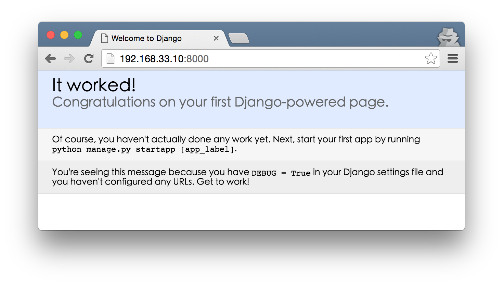

# Django

雖然 Django 跟 BDD/TDD 沒有直接的關係，但為了開發流程的完整概念，我嘗試把 Django 這個 web framework 安裝起來，然後在上面開發與測試。

Let's 開始練功吧

- [Writing your first Django app, part 1](https://docs.djangoproject.com/en/1.9/intro/tutorial01/)
- [Writing your first Django app, part 2](https://docs.djangoproject.com/en/1.9/intro/tutorial02/)
- [Writing your first Django app, part 3](https://docs.djangoproject.com/en/1.9/intro/tutorial03/)
- [Writing your first Django app, part 4](https://docs.djangoproject.com/en/1.9/intro/tutorial04/)
- [Writing your first Django app, part 5](https://docs.djangoproject.com/en/1.9/intro/tutorial05/)
- [Writing your first Django app, part 6](https://docs.djangoproject.com/en/1.9/intro/tutorial06/)
- [Writing your first Django app, part 7](https://docs.djangoproject.com/en/1.9/intro/tutorial07/)

## 寫出第一支 Django 應用 之一

### 檢查套件是否安裝
```shell
$ python -c "import django; print(django.get_version())"
1.9.7
```

### 產生目錄

```shell
$ django-admin startproject mysite
$ tree mysite/
mysite/
├── manage.py
└── mysite
    ├── __init__.py
    ├── settings.py
    ├── urls.py
    └── wsgi.py

1 directory, 5 files
$ cd mysite
```
- 外層 `mysite/`: root directory，名字隨便取
- `manage.py`: 用來操作  Django 專案的命令列工具
- 內層 `mysite/`: 真正放 python 專案的地方，將要 import 一堆東西到這裏。
- `mysite/__init__.py`: 空檔案，告訴 python 各個目錄應該被當成 python package。
- `mysite/settings.py`: 設定檔。
- `mysite/urls.py`: URL 宣告檔，描述網站的內容結構。
- `mysite/wsgi.py`: WSGI-compatible web servers 進入點

###  啟動 Server

```shell
$ python manage.py runserver
Performing system checks...

System check identified no issues (0 silenced).

You have unapplied migrations; your app may not work properly until they are applied.
Run 'python manage.py migrate' to apply them.

June 07, 2016 - 08:38:21
Django version 1.9.7, using settings 'mysite.settings'
Starting development server at http://127.0.0.1:8000/
Quit the server with CONTROL-C.
```
- 預設服務綁定 `http://127.0.0.1:8000/`
 
修改服務綁定位置，讓 host os 可以連接
```shell
$ python manage.py runserver 0.0.0.0:8000
```

設定好之後，透過瀏覽器查看結果



> 確定 server 正常執行後，在執行 `python manage.py runserver` 的 console 按下 <ctrl> + c，中斷程式繼續下面的修改 (之後開發步驟都是 run-test-shutdown 循環，不再累述)

### 產生第一個 app

```shell
$ python manage.py startapp polls
$ tree polls
polls
├── admin.py
├── apps.py
├── __init__.py
├── migrations
│   └── __init__.py
├── models.py
├── tests.py
└── views.py

1 directory, 7 files
```

#### Project vs. apps 的區別
- app 是一個做一些像網誌, 公共紀錄資料庫或小型投票系統的 web application。
- project 是一堆針對某特定網站的設定與 app 的集合。
- 一個 project 可以包含多個 app，一個 app 可以存在多個 project 中。

### 寫第一個 View

修改 polls/views.py:
```python
from django.shortcuts import render
from django.http import HttpResponse

def index(request):
    return HttpResponse("Hello, world. You're at the polls index.")
```
- 最簡的的 view，回應字串

產生 polls/urls.py:
```python
from django.conf.urls import url

from . import views

urlpatterns = [
    url(r'^$', views.index, name='index'),
]
```
- 為了能呼叫到 view，需要將它對應到一個 URL
- 接著設定 URLConf，在當前目錄產生 `urls.py` 檔案，將沒有內容的 URL `r'^$'` 對應到 `index`

修改 root URLConf，讓它知道如何重新導向 polls 的請求，mysite/urls.py:
```python
from django.conf.urls import include, url
from django.contrib import admin

urlpatterns = [
    url(r'^polls/', include('polls.urls')),
    url(r'^admin/', admin.site.urls),
]
```
- `r'^polls/'` 指向在 polls.urls 模組的 root URLconf
- 使用 `include()`參考到其他的 URLConf
- 除了 `admin.site.urls` 之外，其他的 URL pattern 都要用 `include()` 參考過去
- `url(regex, view, kwargs=None, name=None, prefix='')` 傳遞四個參數，先看前兩個
    - 使用正規表示式 `regex` 來匹配 URL
    - 如果正規表示匹配，則呼叫 `view` 函數 

修改完成後啟動 server，透過瀏覽器看到下面訊息
```
Hello, world. You're at the polls index.
```

## 寫出第一支 Django 應用 之二

