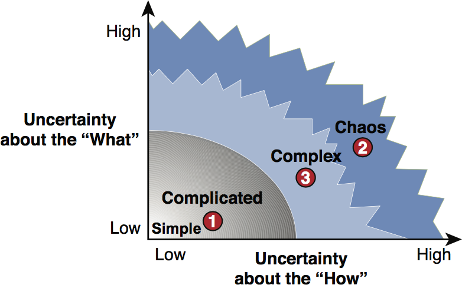
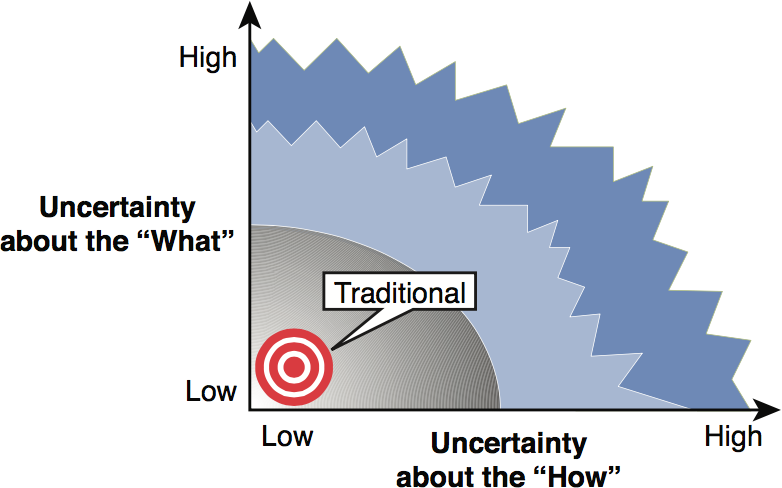
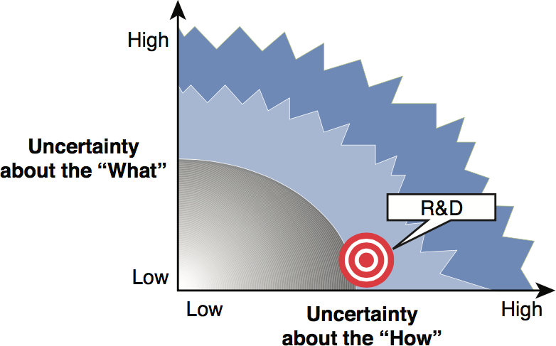
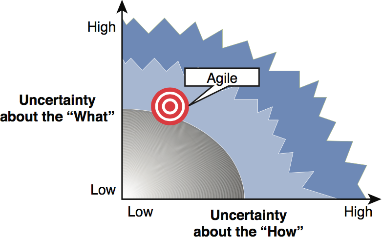

# Quotes of Executable Specifications with Scrum

## Chapter 1 - Solving the Right Problem

“Unfortunately, there are still too many bloated and complex software systems. Even if all team members write code correctly, more often than not, they do not efficiently solve the actual problem. There is a distinct disconnect between what the client may want or need and what is subsequently produced.”

“Conversely, when almost all the risks are related to the requirements, you are in the position experienced by the majority of software development teams. This is where using an agile framework, such as Scrum, is appropriate.”

## Chapter 2 - Relying on a Stable Foundation

“The most important element of this team is the presence of someone devoted full time to the specification of the software.”

“The second most important element is a development team with devel- opers who have complementary skills and expertise.”

“The third most important element is a product owner who ensures the development team is the ultimate product.”

“The fourth and final element of importance to creating a healthy team is a team that inspects and adapts repeatedly, using prescribed events.”

“Expressing a shared vision is an activity directed by the product owner. It consists mainly of face-to-face meetings with stakeholders. The result is a short, one-line summary of what the software is supposed to be and do.”

“A feature is a piece of high-level functionality that delivers value to one or more stakeholders.”

“The vision, the meaningful common goal, and the high-level features are guardrails because it is unlikely those will change rapidly.”

## Chapter 3 - Discovering Through Short Feedback Loops and Stakeholders’ Desirements

“Deliberate discovery does not happen from the failure itself but rather from understanding the failure, making an improvement, and then trying again.”

“Frequent feedback loops provide you with the ability to correct errors while costs are minimal. It is the responsibility of the team not only to learn about the problem but also to help stakeholders understand what is being built for them.”

“There is a powerful and important feedback loop that occurs when stakeholders have early access to running software. They can experiment with real software, come up with new ideas, and change their minds about old ideas and perceptions.”

“Fulfilling desirements through early and continuous delivery of valuable software can result in sprints that stakeholders want to evaluate.”

## Chapter 4 - Expressing Desirements with User Stories

“As a `<role>`, I want `<desire>` so that `<benefit>`.”
  - Who = role
  - What = desire
  - Why = benefit

“A well-written user story follows the INVEST mnemonic developed by Bill Wake.”
  - **Independent**: A story should stand alone and be self-contained without depending on other stories.
  - **Negotiable**: A story is a placeholder that facilitates conversation and negotiation between the team and stakeholders. At any time, the story can be rewritten or even discarded. A story is not fixed and set in stone, up until it is part of the upcoming sprint.
  - **Valuable**: A story needs to deliver value to the stakeholders (either the end user or the purchaser).
  - **Estimable**: The team needs to be able to roughly estimate the size of the effort to complete the story.
  - **Small**: A story can start its life as a big placeholder. As time goes by and you better understand the intricacies of the desires, the placeholder will be split into smaller stories. When the most important ones are close to being delivered, they need to be small enough so that they can be completed in a single sprint.
  - **Testable**: A story must provide the necessary information to clearly define the acceptance criteria that confirm the story is completed.

## Chapter 5 - Refining User Stories by Grooming the Product Backlog

“The product owner is responsible for ensuring that the product backlog is always in a healthy state. He is the primary interface between the development team and the stakeholders.”

“There is a major difference between a true analyst and a product owner. Product owners represent the business and have the authority to make decisions that affect their product. Typically, an analyst does not have this decision-making authority.”

“Grooming the backlog boils down to a sequence of four activities: ranking, illustrating, sizing, and splitting user stories.”
- Ranking User Stories with a Dot Voting Method
- Illustrating User Stories with Storyboards
- Sizing User Stories Using Comparison
- Splitting User Stories Along Business Values

“Although, according to the development team, the product owner is perceived as the one who decides the ordering of the backlog, it is actually not his decision. He must rely on stakeholders who are the ones who decide the importance of each story.”

“The product owner is a facilitator, not a decider.”

“If user stories help monitor conversations with stakeholders, storyboards help to illustrate expectations rapidly and cheaply.”

“As experience teaches, stakeholders love to envision the software from the user interface standpoint.”

“Only the development team can identify the size of a story.”

“Humans are poor at estimating absolute sizes. However, we are great at assessing relative sizes.”

“The product owner should not plan stories that are bigger than one-half the velocity.”

“You should focus on the perspective of stakeholders by thin slicing stories that favor the business value. Thin slicing is based on evolutionary architecture; it provides stories that implement only a small bit of functionality, but all the way through the architecture layers of the software.”

“In this regard, over the years, experienced practitioners have acknowledged the necessity of structuring the backlog along a two-dimensional collaboration board. This way of organizing the stories to avoid half-baked incremental iterations was initially promoted by Jeff Patton and is now known as story mapping.”

“When a story has gone through the process of grooming, you have reached an important milestone, which is the transition from conversation to confirmation.”

## Chapter 6 - Confirming User Stories with Scenarios

“If user stories and their storyboards help monitor conversations with stakeholders during backlog grooming, the scenarios help to confirm expectations when the team is ready to plan a new sprint.”

“Success criteria establish the conditions of acceptation from the stakeholders’ point of view. Scenarios are the perfect medium for expressing the success criteria.”

“The scenario contains a precondition, an action, and a consequence.”
  - `Given` A precondition is the current state of the software before action is taken.
  - `When` An action is something that is accomplished to perform the behavior of the scenario.
  - `Then` A consequence is the result of the action.

“Triggering a single action is crucial in keeping the state transition simple.”

“Successful teams don’t use raw examples, they refine the specification from them. They extract the essence from the key examples and turn them into a clear and unambiguous definition of what makes the implementation done, without any extraneous detail.”

“It is important to note that the analyst’s competency is related to the specifications and not to how the software will be implemented.”

“The role of business analysts is now more focused and can be summarized as ensuring that all the scenarios illustrating a story are refined and completed in time for the development team.”

“Because designing the technical solution is not the purpose of the specification, you should focus only on writing scenarios that relate to the business rules.”

“‘Why?’ five times, successively, helps the team understand the true root cause of the scenario and easily reformulate it at the business domain level.”

“A feature is a piece of high-level functionality that delivers value to one or more stakeholders.”

## Chapter 7 - Automating Confirmation with Acceptance Tests

“You must turn scenarios into acceptance tests with minimal changes. An acceptance test is only a copy of a scenario in a format suitable for execution on a computer.”

“First and foremost, we want to confirm requirements have been met. These “executable” scenarios are not a quality assurance tool. They are used to prevent defects, not to discover them.”

“these “executable” scenarios do not replace the need to include quality assurance practices, such as exploratory or unit testing.”

“It goes without saying that the widespread approach of creating tests using record-and-playback tools is inappropriate. ... Their main advantage, which is to enable testers to author tests without having to learn how to craft code, is also their main weakness.”

“Acceptance tests represent assumptions stakeholders made during the specification.”

“The red-green-refactor cycle is the core of Test-Driven Development (TDD). It is a widely recognized programming practice popularized by Kent Beck that promotes the notion of writing tests first when programming a piece of code. TDD relies on the repetition of a short development cycle divided into three stages: the red, the green, and the refactor stage.”

“TDD requires programmers to articulate their assumptions using a test case. Programmers must foresee how the functionality will be used by the test case. TDD places constraints on programmers; it requires that they define the interface before deciding on the implementation. TDD tends to lead to better designs.”

“If the development team members are the only ones who understand the result of the translation, they lose the ability to collaborate effectively with stakeholders.”

“To obtain a failing assertion, the tester must design the programming interface and connect the newly created test with it.”

“When connecting the newly created test, the tester focuses first on defining the outside-facing programming interface and only after that does the programmer go on evolving the internal implementation.”

“The natural candidates for this type of design are the testers because they are the ones responsible for creating a failing acceptance test.”

“You must resist this temptation to mix acceptance tests with continuous integration. Because of hardware constraints, this can unduly slow down the code integration.”

“Testing the “executable” scenarios during the nightly build ensures that every morning the team can easily confirm that the software under construction still meets the evolving specifications.”

## Chapter 8 - Addressing Nonfunctional Requirements

“External quality is how well the software carries out its functions at run time, and as such, is not only visible to stakeholders, but is also highly desirable.”

“Internal quality is characteristics of the software barely visible to stakeholders but which simplifies the process of building and evolving the software.”

## Chapter 9 - Conclusion

“If you are going to put time and effort into solving a problem, ensure that you first solve the right problem and then that you solve it properly.”

“To be successful, you must remember that above all else, needs are emergent and constantly evolving. There is no set plan that can and will be successful. Instead, it is a question of constantly being open to changes and uncertainties. It is only when flexibility is embraced that the proper attitude can be taken.”

----
## 參考
- [Executable Specifications with Scrum](http://www.ibchamber.org/wp-content/uploads/2014/09/AWP.Executable.Specifications.with_.Scrum_.Jul_.2013.pdf)
