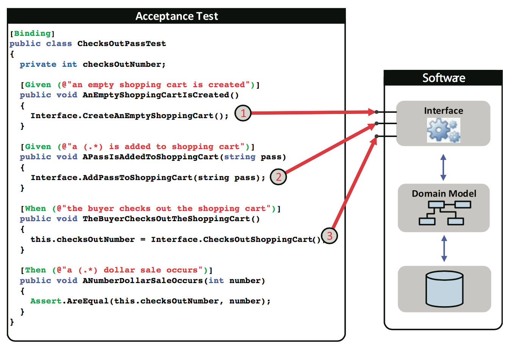

# 實驗

## BDD (Behavior-Driven Development) 

目標：**溝通**帳號註冊與登入的邏輯

準備工作：產生專案目錄，建立 features 與 steps 目錄
```shell
$ mkdir test
$ cd test
$ mkdir -p features/steps
$ tree
.
└── features
    └── steps
```

### 描述功能 (Feature)

在 features/account.feature 檔案一開頭，使用文字描述功能特性，讓創建規格的**產品經理**與實作功能的**程式設計師**在相同的 context 下進行溝通。

```
Feature: User account
    In order to buy or sell commodities
    As a buyer or seller
    I want to have a account in the Ecommerce website
```

### 登入邏輯

在 features/account.feature 描述帳號登入的場景
```
    Scenario: Login as correct username and password
        Given an username django with the password django123 is registered
         When I login as django and give the password django123
         Then I get the login result: successful

    Scenario: Login as incorrect username and password
        Given an username django with the password django123 is registered
         When I login as django and give the password abcdef123
         Then I get the login result: failed
```

在什麼事情都沒做的情形下，執行 behave 會得到錯誤訊息，還有一些貼心的 snippet
```shell
$ behave
Feature: User account # features/account.feature:1
  In order to buy or sell commodities
  As a buyer or seller
  I want to have a account in the Ecommerce website
  Scenario: Login as correct username and password                     # features/account.feature:6
    Given an username django with the password django123 is registered # None
    When I login as django and give the password django123             # None
    Then I get the login result: successful                            # None

  Scenario: Login as incorrect username and password                   # features/account.feature:11
    Given an username django with the password django123 is registered # None
    When I login as django and give the password abcdef123             # None
    Then I get the login result: failed                                # None


Failing scenarios:
  features/account.feature:6  Login as correct username and password
  features/account.feature:11  Login as incorrect username and password

0 features passed, 1 failed, 0 skipped
0 scenarios passed, 2 failed, 0 skipped
0 steps passed, 0 failed, 0 skipped, 6 undefined
Took 0m0.000s

You can implement step definitions for undefined steps with these snippets:

@given(u'an username django with the password django123 is registered')
def step_impl(context):
    raise NotImplementedError(u'STEP: Given an username django with the password django123 is registered')

@when(u'I login as django and give the password django123')
def step_impl(context):
    raise NotImplementedError(u'STEP: When I login as django and give the password django123')

@then(u'I get the login result: successful')
def step_impl(context):
    raise NotImplementedError(u'STEP: Then I get the login result: successful')

@when(u'I login as django and give the password abcdef123')
def step_impl(context):
    raise NotImplementedError(u'STEP: When I login as django and give the password abcdef123')

@then(u'I get the login result: failed')
def step_impl(context):
    raise NotImplementedError(u'STEP: Then I get the login result: failed')

```

用這些 snippet 產生跟應用程式介接的 steps，儲存在 features/steps/account.py
```python
@given(u'an username "django" with the password "django123" is registered')
def step_impl(context):
    pass

@when(u'I login as "django" and give the password "django123"')
def step_impl(context):
    pass

@then(u'I get the login result: "successful"')
def step_impl(context):
    pass

@when(u'I login as "django" and give the password "abcdef123"')
def step_impl(context):
    pass

@then(u'I get the login result: "failed"')
def step_impl(context):
    pass
```

執行 behave，得到下面結果
```shell
$ behave
Feature: User account # features/account.feature:1
  In order to buy or sell commodities
  As a buyer or seller
  I want to have a account in the web site
  Scenario: Login as correct username and password                         # features/account.feature:6
    Given an username "django" with the password "django123" is registered # features/steps/account.py:1 0.000s
    When I login as "django" and give the password "django123"             # features/steps/account.py:5 0.000s
    Then I get the login result: "successful"                              # features/steps/account.py:9 0.000s

  Scenario: Login as incorrect username and password                       # features/account.feature:11
    Given an username "django" with the password "django123" is registered # features/steps/account.py:1 0.000s
    When I login as "django" and give the password "abcdef123"             # features/steps/account.py:13 0.000s
    Then I get the login result: "failed"                                  # features/steps/account.py:17 0.000s

1 feature passed, 0 failed, 0 skipped
2 scenarios passed, 0 failed, 0 skipped
6 steps passed, 0 failed, 0 skipped, 0 undefined
Took 0m0.001s
```
- 測試一個 feature，其中包含兩個 scenario、六個 step
- 測試通過

### 驗收測試 (Acceptance Test) 的意義

function.feature
```
Feature: function description
    As a <role>, I want <desire> so that <benefit>.
    
    Scenario:
        Given statement #1
         When statement #2
         Then statement #3
```

steps.py
```python
@given(u'statement #1')
def step_impl(context, ...):
    function1(...)

@when(u'statement #2')
def step_impl(context, ...):
    function2(...)

@then(u'statement #3')
def step_impl(context):
    assert(...)
```
- 在 steps 裡面的函數只是將服務呼叫派送 (delegate) 到真正的函數

function.py
```
def function1(...):
    # 真正做事情的地方

def function2(...):
    # 真正做事情的地方
```



### 註冊邏輯

在 features/account.feature 描述帳號登入的場景，這次使用 `Scenario Outline` 描述多個測試場景
```
    Scenario Outline: username and password must be large than 5 characters
         When try to register a name <username> with a password <password>
         Then I get the register result: <result>

        Examples: some usernames and passwords
            | username  | password  | result                            |
            | abc       | 123456    | "username or password too short"  |
            | abcedf    | 123       | "username or password too short"  |
            | abc       | 123       | "username or password too short"  |
            | abcdef    | 123456    | "the account is created"          |
```

在 features/steps/account.py 中，相對應的步驟如下
```python
@when(u'try to register a name {username} with a password {password}')
def step_impl(context, username, password):
    pass

@then(u'I get the register result: {result}')
def step_impl(context, result):
    pass
```
- 使用 `{username}`, `{password}`, `{result}` 變數，不需要囉囉唆唆的針對每個場景寫 steps

執行 behave，得到下面有關註冊邏輯的驗證結果
```shell
$ behave
...(略)
  Scenario Outline: username and password must be large than 5 characters -- @1.1 some usernames and passwords  # features/account.feature:22
    When try to register a name abc with a password 123456                                                      # features/steps/account.py:21 0.000s
    Then I get the register result: "username or password too short"                                            # features/steps/account.py:25 0.000s

  Scenario Outline: username and password must be large than 5 characters -- @1.2 some usernames and passwords  # features/account.feature:23
    When try to register a name abcedf with a password 123                                                      # features/steps/account.py:21 0.000s
    Then I get the register result: "username or password too short"                                            # features/steps/account.py:25 0.000s

  Scenario Outline: username and password must be large than 5 characters -- @1.3 some usernames and passwords  # features/account.feature:24
    When try to register a name abc with a password 123                                                         # features/steps/account.py:21 0.000s
    Then I get the register result: "username or password too short"                                            # features/steps/account.py:25 0.000s

  Scenario Outline: username and password must be large than 5 characters -- @1.4 some usernames and passwords  # features/account.feature:25
    When try to register a name abcdef with a password 123456                                                   # features/steps/account.py:21 0.000s
    Then I get the register result: "the account is created"                                                    # features/steps/account.py:25 0.000s

1 feature passed, 0 failed, 0 skipped
6 scenarios passed, 0 failed, 0 skipped
14 steps passed, 0 failed, 0 skipped, 0 undefined
Took 0m0.002s
```

### 中文化

behave 支援許多語系
```shell
$ behave --lang-list
Languages available:
ar: العربية / Arabic
bg: български / Bulgarian
ca: català / Catalan
cs: Česky / Czech
cy-GB: Cymraeg / Welsh
da: dansk / Danish
de: Deutsch / German
en: English / English
en-Scouse: Scouse / Scouse
en-au: Australian / Australian
en-lol: LOLCAT / LOLCAT
en-pirate: Pirate / Pirate
en-tx: Texan / Texan
eo: Esperanto / Esperanto
es: español / Spanish
et: eesti keel / Estonian
fi: suomi / Finnish
fr: français / French
he: עברית / Hebrew
hr: hrvatski / Croatian
hu: magyar / Hungarian
id: Bahasa Indonesia / Indonesian
is: Íslenska / Icelandic
it: italiano / Italian
ja: 日本語 / Japanese
ko: 한국어 / Korean
lt: lietuvių kalba / Lithuanian
lu: Lëtzebuergesch / Luxemburgish
lv: latviešu / Latvian
nl: Nederlands / Dutch
no: norsk / Norwegian
pl: polski / Polish
pt: português / Portuguese
ro: română / Romanian
ru: русский / Russian
sk: Slovensky / Slovak
sr-Cyrl: Српски / Serbian
sr-Latn: Srpski (Latinica) / Serbian (Latin)
sv: Svenska / Swedish
tr: Türkçe / Turkish
uk: Українська / Ukrainian
uz: Узбекча / Uzbek
vi: Tiếng Việt / Vietnamese
zh-CN: 简体中文 / Chinese simplified
zh-TW: 繁體中文 / Chinese traditional
```

> python3.5 不支援 dict.sort()，要修改 /lib/python3.5/site-packages/behave/__main__.py:65: `iso_codes = sorted(iso_codes)#iso_codes.sort()`

feature 可以寫成中文，只要文件第一行註記使用什麼語言，在 features/帳號.feature
```
# language: zh-TW

功能: 用戶帳號
    為了買賣商品
    身為買家或賣家
    我想要有一個網站帳號

    場景: 用正確的帳號跟密碼登入
        假設< 帳號"django"與密碼"django123"被註冊
          當< 我用"django"與密碼"django123"登入
        那麼< 我得到登入結果"成功"

    場景: 用不正確的帳號跟密碼登入
        假設< 帳號"django"與密碼"django123"被註冊
          當< 我用"django"與密碼"abcdef123"登入
        那麼< 我得到登入結果"失敗"

    場景大綱: 帳號與密碼必須大於5個字元
        當< 嘗試用帳號<帳號>與密碼<密碼>註冊
        那麼< 我得到註冊結果<結果>

        例子: 一些帳號與密碼
            | 帳號      | 密碼      | 結果              |
            | abc       | 123456    | "帳號或密碼太短"  |
            | abcedf    | 123       | "帳號或密碼太短"  |
            | abc       | 123       | "帳號或密碼太短"  |
            | abcdef    | 123456    | "帳號建立"        |
```

步驟也可以用中文編寫，在 features/steps/帳號.py
```python
@given(u'< 帳號"django"與密碼"django123"被註冊')
def step_impl(context):
    pass

@when(u'< 我用"django"與密碼"django123"登入')
def step_impl(context):
    pass

@then(u'< 我得到註冊結果"成功"')
def step_impl(context):
    pass

@when(u'< 我用"django"與密碼"abcdef123"登入')
def step_impl(context):
    pass

@then(u'< 我得到註冊結果"失敗"')
def step_impl(context):
    pass

@then(u'< 我得到登入結果"成功"')
def step_impl(context):
    pass

@then(u'< 我得到登入結果"失敗"')
def step_impl(context):
    pass

@when(u'< 嘗試用帳號{username}與密碼{password}註冊')
def step_impl(context, username, password):
    pass

@then(u'< 我得到註冊結果{result}')
def step_impl(context, result):
    pass
```

執行 behave，得到下面驗證結果
```shell
$ behave --include 帳號
功能: 用戶帳號 # features/帳號.feature:3
  為了買賣商品
  身為買家或賣家
  我想要有一個網站帳號
  場景: 用正確的帳號跟密碼登入                    # features/帳號.feature:8
    假設 < 帳號"django"與密碼"django123"被註冊 # features/steps/帳號.py:1 0.000s
    當 < 我用"django"與密碼"django123"登入   # features/steps/帳號.py:5 0.000s
    那麼 < 我得到登入結果"成功"                 # features/steps/帳號.py:21 0.000s

  場景: 用不正確的帳號跟密碼登入                   # features/帳號.feature:13
    假設 < 帳號"django"與密碼"django123"被註冊 # features/steps/帳號.py:1 0.000s
    當 < 我用"django"與密碼"abcdef123"登入   # features/steps/帳號.py:13 0.000s
    那麼 < 我得到登入結果"失敗"                 # features/steps/帳號.py:25 0.000s

  場景大綱: 帳號與密碼必須大於5個字元 -- @1.1 一些帳號與密碼  # features/帳號.feature:24
    當 < 嘗試用帳號abc與密碼123456註冊            # features/steps/帳號.py:29 0.000s
    那麼 < 我得到註冊結果"帳號或密碼太短"              # features/steps/帳號.py:33 0.000s

  場景大綱: 帳號與密碼必須大於5個字元 -- @1.2 一些帳號與密碼  # features/帳號.feature:25
    當 < 嘗試用帳號abcedf與密碼123註冊            # features/steps/帳號.py:29 0.000s
    那麼 < 我得到註冊結果"帳號或密碼太短"              # features/steps/帳號.py:33 0.000s

  場景大綱: 帳號與密碼必須大於5個字元 -- @1.3 一些帳號與密碼  # features/帳號.feature:26
    當 < 嘗試用帳號abc與密碼123註冊               # features/steps/帳號.py:29 0.000s
    那麼 < 我得到註冊結果"帳號或密碼太短"              # features/steps/帳號.py:33 0.000s

  場景大綱: 帳號與密碼必須大於5個字元 -- @1.4 一些帳號與密碼  # features/帳號.feature:27
    當 < 嘗試用帳號abcdef與密碼123456註冊         # features/steps/帳號.py:29 0.000s
    那麼 < 我得到註冊結果"帳號建立"                 # features/steps/帳號.py:33 0.000s

1 feature passed, 0 failed, 0 skipped
6 scenarios passed, 0 failed, 0 skipped
14 steps passed, 0 failed, 0 skipped, 0 undefined
Took 0m0.002s
```
> 說實在，除非必要，不然使用中文寫規格只是炫技而已

## TDD

目標：**實作**帳號註冊與登入的邏輯

設定 mysql 環境
```mysql
CREATE DATABASE `test`;
USE `test`;

CREATE TABLE `account` (
  `id` int(11) NOT NULL AUTO_INCREMENT,
  `username` varchar(50) NOT NULL,
  `password` varchar(50) NOT NULL,
  PRIMARY KEY (`id`)
) ENGINE=InnoDB AUTO_INCREMENT=2 DEFAULT CHARSET=latin1;

INSERT INTO `account` VALUES (1,'abcdef','123456');
```
- `account` 表格內有一筆帳號: {username=abcdef, password=123456}

----
## 參考
- https://insights.sei.cmu.edu/sei_blog/2013/11/using-v-models-for-testing.html
- 
