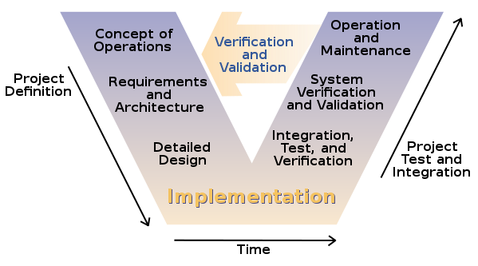

# 實驗

### 前言

這份筆記紀錄 TDD 與 BDD 的開發步驟，實驗意義大於真實開發所需要的步驟。過程中，筆記與程式碼 (在 test/ 目錄中) 幾經修修改改，除非你很有興趣想聽我碎碎念，不然建議不要看這篇 XD

### 準備工作

設定 mysql 環境
```mysql
CREATE DATABASE `test`;
USE `test`;

CREATE TABLE `account` (
  `id` int(11) NOT NULL AUTO_INCREMENT,
  `username` varchar(50) NOT NULL,
  `password` varchar(50) NOT NULL,
  PRIMARY KEY (`id`)
) ENGINE=InnoDB AUTO_INCREMENT=1 DEFAULT CHARSET=latin1;
```

## BDD (Behavior-Driven Development) 

目標：**溝通**帳號註冊與登入的邏輯

準備工作：產生專案目錄，建立 features 與 steps 目錄
```shell
$ mkdir test
$ cd test
$ mkdir -p features/steps
$ tree
.
└── features
    └── steps
```

### 描述功能 (Feature)

在 features/account.feature 檔案一開頭，使用文字描述功能特性，讓創建規格的**產品經理**與實作功能的**程式設計師**在相同的 context 下進行溝通。

```
Feature: User account
    In order to buy or sell commodities
    As a buyer or seller
    I want to have a account in the Ecommerce website
```

### 登入邏輯

在 features/account.feature 描述帳號登入的場景
```
    Scenario: Login as correct username and password
        Given an username django with the password django123 is registered
         When I login as django and give the password django123
         Then I get the login result: successful

    Scenario: Login as incorrect username and password
        Given an username django with the password django123 is registered
         When I login as django and give the password abcdef123
         Then I get the login result: failed
```

在什麼事情都沒做的情形下，執行 behave 會得到錯誤訊息，還有一些貼心的 snippet
```shell
$ behave
...(略)

0 features passed, 1 failed, 0 skipped
0 scenarios passed, 2 failed, 0 skipped
0 steps passed, 0 failed, 0 skipped, 6 undefined
Took 0m0.000s

You can implement step definitions for undefined steps with these snippets:

@given(u'an username django with the password django123 is registered')
def step_impl(context):
    raise NotImplementedError(u'STEP: Given an username django with the password django123 is registered')

@when(u'I login as django and give the password django123')
def step_impl(context):
    raise NotImplementedError(u'STEP: When I login as django and give the password django123')

@then(u'I get the login result: successful')
def step_impl(context):
    raise NotImplementedError(u'STEP: Then I get the login result: successful')

@when(u'I login as django and give the password abcdef123')
def step_impl(context):
    raise NotImplementedError(u'STEP: When I login as django and give the password abcdef123')

@then(u'I get the login result: failed')
def step_impl(context):
    raise NotImplementedError(u'STEP: Then I get the login result: failed')
```

修改上面的 snippet 產生跟應用程式介接的 steps，儲存在 features/steps/steps.py
```python
@given(u'an username {username} with the password {password} is registered')
def step_impl(context, username, password):
    raise NotImplementedError(u'STEP: Given an username {username} with the password {password} is registered')

@when(u'I login as {username} and give the password {password}')
def step_impl(context, username, password):
    raise NotImplementedError(u'STEP: When I login as {username} and give the password {password}')

@then(u'I get the login result: {result}')
def step_impl(context, result):
    raise NotImplementedError(u'STEP: Then I get the login result: {result}')
```

再次執行 behave，得到下面結果
```shell
Feature: User account # features/account.feature:1
  In order to buy or sell commodities
  As a buyer or seller
  I want to have a account in the Ecommerce website
  Scenario: Login as correct username and password                     # features/account.feature:6
    Given an username django with the password django123 is registered # features/steps/steps.py:1 0.000s
      Traceback (most recent call last):
        ...(略)
      NotImplementedError: STEP: Given an username {username} with the password {password} is registered

    When I login as django and give the password django123             # None
    Then I get the login result: successful                            # None

  Scenario: Login as incorrect username and password                   # features/account.feature:11
    Given an username django with the password django123 is registered # features/steps/steps.py:1 0.000s
      Traceback (most recent call last):
        ...(略)
      NotImplementedError: STEP: Given an username {username} with the password {password} is registered

    When I login as django and give the password abcdef123             # None
    Then I get the login result: failed                                # None


Failing scenarios:
  features/account.feature:6  Login as correct username and password
  features/account.feature:11  Login as incorrect username and password

0 features passed, 1 failed, 0 skipped
0 scenarios passed, 2 failed, 0 skipped
0 steps passed, 2 failed, 4 skipped, 0 undefined
Took 0m0.001s
```
- regular expression 解析 `{username}`, `{password}`, `{result}` 的部分ok，
- 但因為功能尚未實作，得到測試錯誤的結果 (符合預期)

### 驗收測試 (Acceptance Test) 的意義


參考上圖 (請搭配下面的程式用力想像)，steps.py 將 function.feature 裡面定義的 Given-When-Then 變成可執行的程式，但不是在這裡把功能做出來，而只是把上層的請求派送 (delegate) 到真正做事的地方 function.py。

function.feature
```
Feature: function description
    As a <role>, I want <desire> so that <benefit>.
    
    Scenario:
        Given statement #1
         When statement #2
         Then statement #3
```

steps.py
```python
@given(u'statement #1')
def step_impl(context, ...):
    function1(...)

@when(u'statement #2')
def step_impl(context, ...):
    function2(...)

@then(u'statement #3')
def step_impl(context):
    assert(...)
```

function.py
```python
def function1(...):
    # 真正做事情的地方

def function2(...):
    # 真正做事情的地方
```

接下來，我們會透過 TDD 的方式把底層功能實作出來。但真正開始實作功能之前，先思考介面(或是服務接口)如何設計。

回頭修改 features/steps/steps.py 
```python
@given(u'an username {username} with the password {password} is registered')
def step_impl(context, username, password):
    account_insert(username, password)

@when(u'I login as {username} and give the password {password}')
def step_impl(context, username, password):
    context.result = "successful" if account_login(username, password) == True else "failed"

@then(u'I get the login result: {result}')
def step_impl(context, result):
    assert(context.result == result)
```

執行 behave
```shell
$ behave
Feature: User account # features/account.feature:1
  In order to buy or sell commodities
  As a buyer or seller
  I want to have a account in the Ecommerce website
  Scenario: Login as correct username and password                     # features/account.feature:6
    Given an username django with the password django123 is registered # features/steps/steps.py:1 0.000s
      Traceback (most recent call last):
        ...(略)
      NameError: name 'account_insert' is not defined

    When I login as django and give the password django123             # None
    Then I get the login result: successful                            # None

  Scenario: Login as incorrect username and password                   # features/account.feature:11
    Given an username django with the password django123 is registered # features/steps/steps.py:1 0.000s
      Traceback (most recent call last):
        ...(略)
      NameError: name 'account_insert' is not defined

    When I login as django and give the password abcdef123             # None
    Then I get the login result: failed                                # None


Failing scenarios:
  features/account.feature:6  Login as correct username and password
  features/account.feature:11  Login as incorrect username and password

0 features passed, 1 failed, 0 skipped
0 scenarios passed, 2 failed, 0 skipped
0 steps passed, 2 failed, 4 skipped, 0 undefined
Took 0m0.000s
```

還是執行失敗，但不同的是，錯誤訊息告訴我們 "NameError: name 'account_insert' is not defined" 有個函數沒有定義，接著就把它定義出來吧。

產生 features/steps/account.py，負責帳號管理
```python
def account_insert(username, password):
    pass

def account_login(username, password):
    pass

def account_register(username, password):
    pass
```

修改 features/steps/steps.py ，把 `form account import *` 加在最上面

執行 behave
```shell
$ behave
Feature: User account # features/account.feature:1
  In order to buy or sell commodities
  As a buyer or seller
  I want to have a account in the Ecommerce website
  Scenario: Login as correct username and password                     # features/account.feature:6
    Given an username django with the password django123 is registered # features/steps/steps.py:3 0.000s
    When I login as django and give the password django123             # features/steps/steps.py:7 0.000s
    Then I get the login result: successful                            # features/steps/steps.py:11 0.000s
      Traceback (most recent call last):
        ...(略)
      AssertionError


  Scenario: Login as incorrect username and password                   # features/account.feature:11
    Given an username django with the password django123 is registered # features/steps/steps.py:3 0.000s
    When I login as django and give the password abcdef123             # features/steps/steps.py:7 0.000s
    Then I get the login result: failed                                # features/steps/steps.py:11 0.000s


Failing scenarios:
  features/account.feature:6  Login as correct username and password

0 features passed, 1 failed, 0 skipped
1 scenario passed, 1 failed, 0 skipped
5 steps passed, 1 failed, 0 skipped, 0 undefined
Took 0m0.001s
```

因為串接了底層的功能，場景 (Scenario) 的 `Given`, `When` 可以順利執行，但又因為沒有真的做什麼，所以 `Then` 驗證結果時發生錯誤 (第二個場景通過測試只是剛好條件符合而已，不是真的因為底層提供功能而通過)。

至此介面算是串接完成，我們先放下 BDD，來看看如何用 TDD 開發下層。

## TDD (Test-Driven Development) 

雖然先有 interface，但接下來不是要實作功能，而是把單元測試補上

修改 features/steps/account.py，增加以下測試
```python
import unittest
class TestAccount(unittest.TestCase):

    @unittest.skip("need database mock")
    def test_account_insert(self):
        pass

    @unittest.skip("need database mock")
    def test_login_with_correct_username_password(self):
        pass

    @unittest.skip("need database mock")
    def test_login_with_invalid_username(self):
        pass

    @unittest.skip("need database mock")
    def test_login_with_invalid_password(self):
        pass

    @unittest.skip("need database mock")
    def test_register_with_valid_username_password(self):
        pass

    @unittest.skip("need database mock")
    def test_reigster_with_invalid_username(self):
        pass

    @unittest.skip("need database mock")
    def test_register_with_invalid_password(self):
        pass
```

account 需要跟資料庫互動才能完成 `account_insert`, `account_login`, `account_register` 的功能，但我想把這個依賴關係切開，先把測試標記為 skip

接下來不用 behave 進行測試，改用 `python -m unittest`
```shell
$ python -m unittest -v account
test_account_insert (account.TestAccount) ... skipped 'need database mock'
test_login_with_correct_username_password (account.TestAccount) ... skipped 'need database mock'
test_login_with_invalid_password (account.TestAccount) ... skipped 'need database mock'
test_login_with_invalid_username (account.TestAccount) ... skipped 'need database mock'
test_register_with_invalid_password (account.TestAccount) ... skipped 'need database mock'
test_register_with_valid_username_password (account.TestAccount) ... skipped 'need database mock'
test_reigster_with_invalid_username (account.TestAccount) ... skipped 'need database mock'

----------------------------------------------------------------------
Ran 7 tests in 0.005s

OK (skipped=7)
```

要切開與底層資料庫的依賴關係，要借用 unittest.mock 偽裝 database connector。先看看正常網路 MySQL-Connector 運作的方式，再決定如何偽造
```python
import mysql.connector

cnx = mysql.connector.connect(user='root', password='000000', host='127.0.0.1', database='test')
cursor = cnx.cursor()

query = "TRUNCATE TABLE account"
cursor.execute(query)
cnx.commit()

query = "INSERT INTO account (username, password) VALUES ('abcdef', '123456')"
cursor.execute(query)
cnx.commit()

query = "SELECT * FROM account WHERE username='%s'" % 'abcdef'
cursor.execute(query)
result = cursor.fetchone()
print(result)

cursor.close()
cnx.close()
```
- 先不管 `mysql.connector.connect()`, `cnx.cursor()`, `cursor.close()`, `cnx.close()`，這些在 setup, tearDown 才會用到
- `INSERT` 需要 `cursor.execute()` 與 `cnx.commit()`
- `SELECT` 需要 `cursor.execute()` 與 `cursor.fetchone()`

藉由上面的範例，可以預期 `account_insert` 會呼叫到 `cursor.execute()` 與 `cnx.commit()`；而 `account_login` 會呼叫到 `cursor.execute()` 與 `cursor.fetchone()`。

加入 `from unittest.mock import Mock, patch`，移除 `@unittest.skip` 標記，修改單元測試
```python
import unittest
from unittest.mock import Mock, patch
class TestAccount(unittest.TestCase):

    def setUp(self):
        self.result = None

    def test_account_insert(self):
        with patch('mysql.connector.cursor.MySQLCursor.execute') as mock_execute:
            with patch('mysql.connector.connection.MySQLConnection.commit') as mock_commit:
                account_insert('abcdef', '123456')

        mock_execute.assert_called_with("INSERT INTO account (username, password) VALUES ('abcdef', '123456')")
        mock_commit.assert_called_with()

    def test_login_with_correct_username_password(self):
        def mock_execute(_, query):
            self.result = ('1',) if query == "SELECT id FROM account WHERE username='abcdef' AND password='123456'" else None
        def mock_fetchone(_):
            return self.result

        with patch('mysql.connector.cursor.MySQLCursor.execute', mock_execute):
            with patch('mysql.connector.cursor.MySQLCursor.fetchone', mock_fetchone):
                self.assertTrue(account_login('abcdef', '123456'))

    def test_login_with_invalid_username(self):
        def mock_execute(_, query):
            self.result = ('1',) if query == "SELECT id FROM account WHERE username='abcdef' AND password='123456'" else None
        def mock_fetchone(_):
            return self.result

        with patch('mysql.connector.cursor.MySQLCursor.execute', mock_execute):
            with patch('mysql.connector.cursor.MySQLCursor.fetchone', mock_fetchone):
                self.assertFalse(account_login('abc', '123456'))

    def test_login_with_invalid_password(self):
        def mock_execute(_, query):
            self.result = ('1',) if query == "SELECT id FROM account WHERE username='abcdef' AND password='123456'" else None
        def mock_fetchone(_):
            return self.result

        with patch('mysql.connector.cursor.MySQLCursor.execute', mock_execute):
            with patch('mysql.connector.cursor.MySQLCursor.fetchone', mock_fetchone):
                self.assertFalse(account_login('abcdef', '123'))

    def test_register_with_valid_username_password(self):
        with patch('mysql.connector.cursor.MySQLCursor.execute') as mock_execute:
            with patch('mysql.connector.connection.MySQLConnection.commit') as mock_commit:
                self.assertTrue(account_register('abcdef', '123456'))

        self.assertTrue(mock_execute.called)
        self.assertTrue(mock_commit.called)

    def test_reigster_with_invalid_username(self):
        with patch('mysql.connector.cursor.MySQLCursor.execute') as mock_execute:
            with patch('mysql.connector.connection.MySQLConnection.commit') as mock_commit:
                self.assertFalse(account_register('abc', '123456'))

        self.assertFalse(mock_execute.called)
        self.assertFalse(mock_commit.called)

    def test_register_with_invalid_password(self):
        with patch('mysql.connector.cursor.MySQLCursor.execute') as mock_execute:
            with patch('mysql.connector.connection.MySQLConnection.commit') as mock_commit:
                self.assertFalse(account_register('abcdef', '123'))
```

很辛苦的單元測試...
- `test_account_insert` patch 兩個 mysql.connector 的方法，呼叫 `account_insert('abcdef', '123456')`後，檢查
    - `cursor.execute()` 是否傳入 `"INSERT INTO account (username, password) VALUES ('abcdef', '123456')"` 
    - `cnx.commit()` 是否被呼叫
- `test_login_with_correct_username_password`, `test_login_with_invalid_username`, `test_login_with_invalid_password` patch 兩個 mysql.connector 的方法，然後呼叫 `account_login()`
    - `cursor.execute()` 接收 query，如果 query 是預期的則儲存 `('1',)` 否則儲存 `None`
    - `cursor.fetchone()` 回傳之前 query 儲存的結果
- `test_register_with_valid_username_password`, `test_reigster_with_invalid_username`, `test_register_with_invalid_password` patch 兩個 mysql.connector 的方法
    - 如果 `username`, `password` 合法，回傳 `True`，否則回傳 `False`
    - 如果 `username`, `password` 合法，則 `cursor.execute()` 與 `cursor.fetchone()` 會被呼叫

有了單元測試，開時實作功能
```python
import mysql.connector

cnx = mysql.connector.connect(user='root', password='000000', host='127.0.0.1', database='test')
cursor = cnx.cursor()

def account_insert(username, password):
    query = "INSERT INTO account (username, password) VALUES ('%s', '%s')" % (username, password)
    cursor.execute(query)
    cnx.commit()

def account_login(username, password):
    query = "SELECT id FROM account WHERE username='%s' AND password='%s'" % (username, password)
    cursor.execute(query)
    row = cursor.fetchone()
    return (row is not None)

def account_register(username, password):
    if len(username) < 6 or len(password) < 6:
        return False
    account_insert(username, password)
    return True
```

然後測試進行單元測試
```shell
$ python -m unittest -v account
test_account_insert (account.TestAccount) ... ok
test_login_with_correct_username_password (account.TestAccount) ... ok
test_login_with_invalid_password (account.TestAccount) ... ok
test_login_with_invalid_username (account.TestAccount) ... ok
test_register_with_invalid_password (account.TestAccount) ... ok
test_register_with_valid_username_password (account.TestAccount) ... ok
test_reigster_with_invalid_username (account.TestAccount) ... ok

----------------------------------------------------------------------
Ran 7 tests in 0.008s

OK
```

天呀～ 寫到這裡，發現這樣 TDD 真是太辛苦了！好在實務上 [django](https://www.djangoproject.com/) 藉由 Model 切開與資料庫的依賴關係，加上 [behave-django](https://pythonhosted.org/behave-django/) 提供更優良的 mock 技術，才能讓 Python 程式設計師的生活輕鬆點...

抱怨歸抱怨，既然頭已經洗下去，就繼續把它洗乾淨吧 XD

## 業務邏輯

### 驗證登入功能

```python
$ behave
Feature: User account # ../account.feature:1
  In order to buy or sell commodities
  As a buyer or seller
  I want to have a account in the Ecommerce website
  Scenario: Login as correct username and password                     # ../account.feature:6
    Given an username django with the password django123 is registered # steps.py:3 0.006s
    When I login as django and give the password django123             # steps.py:7 0.001s
    Then I get the login result: successful                            # steps.py:11 0.000s

  Scenario: Login as incorrect username and password                   # ../account.feature:11
    Given an username django with the password django123 is registered # steps.py:3 0.002s
    When I login as django and give the password abcdef123             # steps.py:7 0.001s
    Then I get the login result: failed                                # steps.py:11 0.000s

1 feature passed, 0 failed, 0 skipped
2 scenarios passed, 0 failed, 0 skipped
6 steps passed, 0 failed, 0 skipped, 0 undefined
Took 0m0.010s
```

### 新增註冊邏輯

在 features/account.feature 增加描述帳號登入的場景，這次使用 `Scenario Outline` 描述多個測試場景
```
    Scenario Outline: username and password must be large than 5 characters
         When try to register a name <username> with a password <password>
         Then I get the register result: <result>

        Examples: some usernames and passwords
            | username  | password  | result                        |
            | abc       | 123456    | invalid username or password  |
            | abcedf    | 123       | invalid username or password  |
            | abc       | 123       | invalid username or password  |
            | abcdef    | 123456    | successful                    |
```

在 features/steps/account.py 中，相對應的步驟如下
```python
@when(u'try to register a name {username} with a password {password}')
def step_impl(context, username, password):
    if account_register(username, password) == True:
        context.result = "successful"
    else:
        context.result = "invalid username or password"

@then(u'I get the register result: {result}')
def step_impl(context, result):
    assert(context.result == result)
```
- 使用 `{username}`, `{password}`, `{result}` 變數，不需要囉囉唆唆的針對每個場景寫 steps

執行 behave，得到下面有關註冊邏輯的驗證結果
```shell
$ behave
...(略)

  Scenario Outline: username and password must be large than 5 characters -- @1.1 some usernames and passwords  # account.feature:22
    When try to register a name abc with a password 123456                                                      # steps/steps.py:18 0.000s
    Then I get the register result: invalid username or password                                                # steps/steps.py:25 0.000s

  Scenario Outline: username and password must be large than 5 characters -- @1.2 some usernames and passwords  # account.feature:23
    When try to register a name abcedf with a password 123                                                      # steps/steps.py:18 0.001s
    Then I get the register result: invalid username or password                                                # steps/steps.py:25 0.000s

  Scenario Outline: username and password must be large than 5 characters -- @1.3 some usernames and passwords  # account.feature:24
    When try to register a name abc with a password 123                                                         # steps/steps.py:18 0.000s
    Then I get the register result: invalid username or password                                                # steps/steps.py:25 0.000s

  Scenario Outline: username and password must be large than 5 characters -- @1.4 some usernames and passwords  # account.feature:25
    When try to register a name abcdef with a password 123456                                                   # steps/steps.py:18 0.001s
    Then I get the register result: successful                                                                  # steps/steps.py:25 0.000s

...(略)
```

### 中文化

behave 支援許多語系
```shell
$ behave --lang-list
Languages available:
ar: العربية / Arabic
bg: български / Bulgarian
ca: català / Catalan
cs: Česky / Czech
cy-GB: Cymraeg / Welsh
da: dansk / Danish
de: Deutsch / German
en: English / English
en-Scouse: Scouse / Scouse
en-au: Australian / Australian
en-lol: LOLCAT / LOLCAT
en-pirate: Pirate / Pirate
en-tx: Texan / Texan
eo: Esperanto / Esperanto
es: español / Spanish
et: eesti keel / Estonian
fi: suomi / Finnish
fr: français / French
he: עברית / Hebrew
hr: hrvatski / Croatian
hu: magyar / Hungarian
id: Bahasa Indonesia / Indonesian
is: Íslenska / Icelandic
it: italiano / Italian
ja: 日本語 / Japanese
ko: 한국어 / Korean
lt: lietuvių kalba / Lithuanian
lu: Lëtzebuergesch / Luxemburgish
lv: latviešu / Latvian
nl: Nederlands / Dutch
no: norsk / Norwegian
pl: polski / Polish
pt: português / Portuguese
ro: română / Romanian
ru: русский / Russian
sk: Slovensky / Slovak
sr-Cyrl: Српски / Serbian
sr-Latn: Srpski (Latinica) / Serbian (Latin)
sv: Svenska / Swedish
tr: Türkçe / Turkish
uk: Українська / Ukrainian
uz: Узбекча / Uzbek
vi: Tiếng Việt / Vietnamese
zh-CN: 简体中文 / Chinese simplified
zh-TW: 繁體中文 / Chinese traditional
```

> python3.5 不支援 dict.sort()，要修改 /lib/python3.5/site-packages/behave/__main__.py:65: `iso_codes = sorted(iso_codes)#iso_codes.sort()`

feature 可以寫成中文，只要文件第一行註記使用什麼語言，在 features/帳號.feature
```
# language: zh-TW

功能: 用戶帳號
    為了買賣商品
    身為買家或賣家
    我想要有一個電子商務網站帳號

    場景: 用正確的帳號跟密碼登入
        假設< 帳號django與密碼django123已註冊
          當< 我用django與密碼django123登入
        那麼< 我得到登入結果：成功

    場景: 用不正確的帳號跟密碼登入
        假設< 帳號django與密碼django123已註冊
          當< 我用django與密碼abcdef123登入
        那麼< 我得到登入結果：失敗

    場景大綱: 帳號與密碼必須大於5個字元
        當< 嘗試用帳號<username>與密碼<password>註冊
        那麼< 我得到註冊結果：<result>

        例子: 一些帳號與密碼
            | username  | password  | result            |
            | abc       | 123456    | 無效的帳號或密碼  |
            | abcedf    | 123       | 無效的帳號或密碼  |
            | abc       | 123       | 無效的帳號或密碼  |
            | abcdef    | 123456    | 帳號建立          |
```

步驟也可以用中文編寫，在 features/steps/步驟.py
```python
from account import *

@given(u'< 帳號{username}與密碼{password}已註冊')
def step_impl(context, username, password):
    account_insert(username, password)

@when(u'< 我用{username}與密碼{password}登入')
def step_impl(context, username, password):
    if account_login(username, password) == True:
        context.result = "成功"
    else:
        context.result = "失敗"

@then(u'< 我得到登入結果：{result}')
def step_impl(context, result):
    assert(context.result == result)

@when(u'< 嘗試用帳號{username}與密碼{password}註冊')
def step_impl(context, username, password):
    if account_register(username, password) == True:
        context.result = "帳號建立"
    else:
        context.result = "無效的帳號或密碼"

@then(u'< 我得到註冊結果：{result}')
def step_impl(context, result):
    assert(context.result == result)
```

- features/account.feature 與 features/帳號.feature 做一樣的檢查
- features/steps/step.py 與 features/steps/步驟.py 做一樣的事情

執行 behave，得到下面驗證結果
```shell
$ mysql -uroot -p000000 -e 'truncate table account' test
$ behave --include 帳號
功能: 用戶帳號 # features/帳號.feature:3
  為了買賣商品
  身為買家或賣家
  我想要有一個電子商務網站帳號
  場景: 用正確的帳號跟密碼登入                # features/帳號.feature:8
    假設 < 帳號django與密碼django123已註冊 # features/steps/步驟.py:3 0.001s
    當 < 我用django與密碼django123登入   # features/steps/步驟.py:7 0.001s
    那麼 < 我得到登入結果：成功              # features/steps/步驟.py:14 0.000s

  場景: 用不正確的帳號跟密碼登入               # features/帳號.feature:13
    假設 < 帳號django與密碼django123已註冊 # features/steps/步驟.py:3 0.010s
    當 < 我用django與密碼abcdef123登入   # features/steps/步驟.py:7 0.001s
    那麼 < 我得到登入結果：失敗              # features/steps/步驟.py:14 0.000s

  場景大綱: 帳號與密碼必須大於5個字元 -- @1.1 一些帳號與密碼  # features/帳號.feature:24
    當 < 嘗試用帳號abc與密碼123456註冊            # features/steps/步驟.py:18 0.000s
    那麼 < 我得到註冊結果：無效的帳號或密碼              # features/steps/步驟.py:25 0.000s

  場景大綱: 帳號與密碼必須大於5個字元 -- @1.2 一些帳號與密碼  # features/帳號.feature:25
    當 < 嘗試用帳號abcedf與密碼123註冊            # features/steps/步驟.py:18 0.000s
    那麼 < 我得到註冊結果：無效的帳號或密碼              # features/steps/步驟.py:25 0.000s

  場景大綱: 帳號與密碼必須大於5個字元 -- @1.3 一些帳號與密碼  # features/帳號.feature:26
    當 < 嘗試用帳號abc與密碼123註冊               # features/steps/步驟.py:18 0.000s
    那麼 < 我得到註冊結果：無效的帳號或密碼              # features/steps/步驟.py:25 0.000s

  場景大綱: 帳號與密碼必須大於5個字元 -- @1.4 一些帳號與密碼  # features/帳號.feature:27
    當 < 嘗試用帳號abcdef與密碼123456註冊         # features/steps/步驟.py:18 0.002s
    那麼 < 我得到註冊結果：帳號建立                  # features/steps/步驟.py:25 0.000s

1 feature passed, 0 failed, 0 skipped
6 scenarios passed, 0 failed, 0 skipped
14 steps passed, 0 failed, 0 skipped, 0 undefined
Took 0m0.016s
```

> 這邊有個環境的設定問題：因為測試註冊功能會在資料庫插入一筆資料，數次實驗後會有多筆，如果每次測試前沒有清空資料庫，就會測試失敗... 每次測試，環境都要獨立、要獨立、要獨立，獨立很重要所以說三次！這部分先欠著，等使用 behave-django 再交代清楚。

## Using V Models for Testing



(圖片來源 https://en.wikipedia.org/wiki/V-Model)

- 軟體開發從定義需求開始，透過文字 PM 與 QC 共同定義 features
- QC 將 features 轉成可執行的 steps
- RD 透過 TDD 方式實作 functions，滿足 features
- PM 與 QC 確認功能正常
