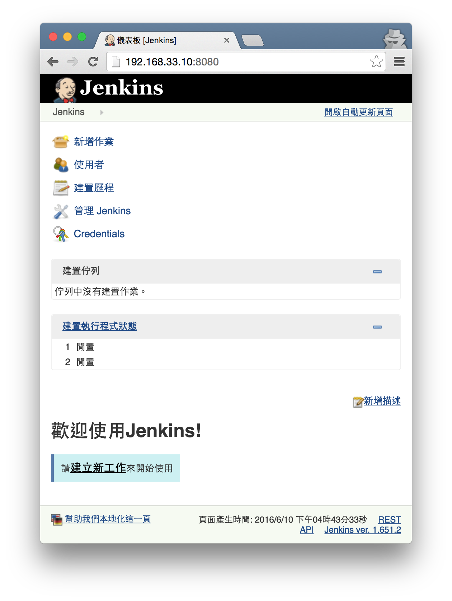

# Jenkins

Jenkins is an award-winning, cross-platform, **continuous integration** and **continuous delivery** application that increases your productivity. Use Jenkins to build and test your software projects continuously making it easier for developers to integrate changes to the project, and making it easier for users to obtain a fresh build. It also allows you to continuously deliver your software by providing powerful ways to define your build pipelines and integrating with a large number of testing and deployment technologies. - 摘錄 [Jenkins](https://wiki.jenkins-ci.org/display/JENKINS/Meet+Jenkins) 官網介紹

## 安裝

參考: https://wiki.jenkins-ci.org/display/JENKINS/Installing+Jenkins+on+Ubuntu

依照官網說明安裝 Jenkins 非常簡單
```shell
$ wget -q -O - https://jenkins-ci.org/debian/jenkins-ci.org.key | sudo apt-key add -
$ sudo sh -c 'echo deb http://pkg.jenkins-ci.org/debian-stable binary/ > /etc/apt/sources.list.d/jenkins.list'
$ sudo apt-get update
$ sudo apt-get install jenkins
```

安裝完後，Jenkins 預設已經啟動
```shell
$ ps aux | grep jenkins
jenkins  10670  0.0  0.0  18596   172 ?        S    16:27   0:00 /usr/bin/daemon --name=jenkins --inherit --env=JENKINS_HOME=/var/lib/jenkins --output=/var/log/jenkins/jenkins.log --pidfile=/var/run/jenkins/jenkins.pid -- /usr/bin/java -Djava.awt.headless=true -jar /usr/share/jenkins/jenkins.war --webroot=/var/cache/jenkins/war --httpPort=8080 --ajp13Port=-1
jenkins  10671  9.9 35.4 1186188 179532 ?      Sl   16:27   0:34 /usr/bin/java -Djava.awt.headless=true -jar /usr/share/jenkins/jenkins.war --webroot=/var/cache/jenkins/war --httpPort=8080 --ajp13Port=-1
vagrant  10752  0.0  0.4  12720  2124 pts/1    S+   16:33   0:00 grep --color=auto jenkins
```

設定 Jenkins 服務
```shell
$ sudo service jenkins start        # 啟動
$ sudo service jenkins stop         # 停止
$ sudo service jenkins restart      # 重新啟動
```

## 啟動與存取

參考: https://wiki.jenkins-ci.org/display/JENKINS/Starting+and+Accessing+Jenkins

啟動 Jenkins 最簡單的方式
```shell
$ java -jar jenkins.war
```

打開瀏覽器，開啟 http://192.168.33.10:8080/ (192.168.33.10 是[虛擬機](environment.md)的IP)，就能看到管理介面

### 變更語言

啟動 Jenkins 後，因為瀏覽器語系關係為顯示為中文操作介面，想改成與官網說明一樣的英文介面，依照下面步驟

- 安裝插件：「管理 Jenkins」→「管理外掛程式」→「過濾條件」輸入 locale →「
下載並於重新啟動後安裝」
- 變更語系：「管理 Jenkins」→「設定系統」→「預設語言」輸入 en_US，並選取「Ignore browser preference and force this language to all users」



### Jenkins 功能階層圖
```
Jenkins Home
    |-- Jenkins configure
    |-- Build Jobs
        |-- Job_A
        |   |-- Job Configure
        |   |-- Build History
        |       |-- Build #1
        |       |-- Build #2
        |       |-- Build #3
        |-- Job_B
        |-- Job_C
```

## 建立第一個 Build Job - “Hello World”

### 建立專案

- 到 Jenkins 首頁，選擇「create new jobs」
- 「Item name」填入 `ProjectOne`，選擇「Freestyle project」，接著進入設定 Build Job 細節頁面
- 「Build」內按下「Add build step」，選擇「Execute shell」，「Command」填入下面 shell script
- 按下「Save」儲存離開

```shell
#!/bin/bash
echo "Hello World"
```

### 手動執行

- 到「ProjectOne」頁面，點選「Build Now」
- 看到「Build History」出現 Build item，點選 #1
- 點選「Console Output」，看到以下 Build process

```
Started by user anonymous
Building in workspace /var/lib/jenkins/jobs/ProjectOne/workspace
[workspace] $ /bin/bash /tmp/hudson2917613460417409130.sh
Hello World
Finished: SUCCESS
```

### 自動執行 (週期)

- 到「ProjectOne」頁面，點選「Configure」
- 「Build Triggers」下點選「Build periodically」，「Schedule」填入 `* * * * *` (表示每分鐘 build 一次)
- 按下「Save」儲存離開
- 等待數分鐘，看到「Build History」出現多個 Build item

### 刪除專案

- 到「ProjectOne」頁面，點選「Delete Project」
- 「Are you sure about deleting the Project ‘ProjectOne’?」，選擇「確定/Yes」
- 專案已被刪除

## 建立第二個 Build Job - 配合 Git 進行自動化建置

### 安裝 Git plugin

- 到 Jenkins 首頁，選擇「Manage Jenkins」
- 點選「Manage Plugins」，進入設定插件管理頁面
- 選擇「Available」標籤，「filter」輸入 `Git plugin`
- 選取「Git plugin」，按下「Install without restart」
- 等候安裝完成

#### 安裝以下套件

```
Git client plugin	Success
Git plugin	        Success
```

### 建立 Git project

#### 建立目錄

```shell
$ mkdir jenkins-test
$ cd jenkins-test
$ pwd
/home/vagrant/jenkins-test
```

#### 初始化 Git repository

```shell
$ git init
```

#### 產生 HelloWorld.py

```
$ echo 'print("Hello World")' > HelloWorld.py
$ python HelloWorld.py
Hello World
```

#### 將 HelloWorld.py 加入 git

```shell
$ git add .
$ git commit -m "add a python file"
```

### 建立專案

- 到 Jenkins 首頁，選擇「create new jobs」
- 「Item name」填入 `ProjectTwo`，選擇「Freestyle project」，接著進入設定 Build Job 細節頁面
- 「Source Code Management」下選擇「Git」，「Repository URL」填入 `file:///home/vagrant/jenkins-test
`
- 「Build」內按下「Add build step」，選擇「Execute shell」，「Command」填入下面 shell script
- 按下「Save」儲存離開
```shell
#!/bin/bash
python HelloWorld.py
```

### 手動執行

- 到「ProjectTwo」頁面，點選「Build Now」
- 看到「Build History」出現 Build item，點選 #1
- 點選「Console Output」，看到以下 Build process

```
Started by user anonymous
Building in workspace /var/lib/jenkins/jobs/ProjectTwo/workspace
Cloning the remote Git repository
Cloning repository file:///home/vagrant/jenkins-test
 > git init /var/lib/jenkins/jobs/ProjectTwo/workspace # timeout=10
Fetching upstream changes from file:///home/vagrant/jenkins-test
 > git --version # timeout=10
 > git -c core.askpass=true fetch --tags --progress file:///home/vagrant/jenkins-test +refs/heads/*:refs/remotes/origin/*
 > git config remote.origin.url file:///home/vagrant/jenkins-test # timeout=10
 > git config --add remote.origin.fetch +refs/heads/*:refs/remotes/origin/* # timeout=10
 > git config remote.origin.url file:///home/vagrant/jenkins-test # timeout=10
Fetching upstream changes from file:///home/vagrant/jenkins-test
 > git -c core.askpass=true fetch --tags --progress file:///home/vagrant/jenkins-test +refs/heads/*:refs/remotes/origin/*
 > git rev-parse refs/remotes/origin/master^{commit} # timeout=10
 > git rev-parse refs/remotes/origin/origin/master^{commit} # timeout=10
Checking out Revision 1efe2522977e2ae51be6a3fd8f249ac1a9e0a03c (refs/remotes/origin/master)
 > git config core.sparsecheckout # timeout=10
 > git checkout -f 1efe2522977e2ae51be6a3fd8f249ac1a9e0a03c
First time build. Skipping changelog.
[workspace] $ /bin/bash /tmp/hudson1698813741464662757.sh
Hello World
Finished: SUCCESS
```

### 自動執行 (週期)

- 到「ProjectTwo」頁面，點選「Configure」
- 「Build Triggers」下點選「Poll SCM」，「Schedule」填入 `* * * * *` (表示每分鐘查詢 git repository 一次，如果 git repository 有更新則觸發 Build Job)
- 按下「Save」儲存離開
- 如果 git repository 有更新，就可以在一分鐘內看到自動執行的 build

#### 修改 HelloWorld.py 內容

```python
print("Hello World, Jenkins")
```

#### 更新 git repository

```shell
$ git add HelloWorld.py
$ git commit -m "modify HelloWorld.py"
```

- 到「ProjectTwo」頁面
- 看到「Build History」出現 Build item，點選 #2
- 點選「Console Output」，看到以下 Build process

```
Started by an SCM change
Building in workspace /var/lib/jenkins/jobs/ProjectTwo/workspace
 > git rev-parse --is-inside-work-tree # timeout=10
Fetching changes from the remote Git repository
 > git config remote.origin.url file:///home/vagrant/jenkins-test # timeout=10
Fetching upstream changes from file:///home/vagrant/jenkins-test
 > git --version # timeout=10
 > git -c core.askpass=true fetch --tags --progress file:///home/vagrant/jenkins-test +refs/heads/*:refs/remotes/origin/*
 > git rev-parse refs/remotes/origin/master^{commit} # timeout=10
 > git rev-parse refs/remotes/origin/origin/master^{commit} # timeout=10
Checking out Revision 996523706ed38a101b9d979a38c1c6830fe4a9d0 (refs/remotes/origin/master)
 > git config core.sparsecheckout # timeout=10
 > git checkout -f 996523706ed38a101b9d979a38c1c6830fe4a9d0
 > git rev-list 1efe2522977e2ae51be6a3fd8f249ac1a9e0a03c # timeout=10
[workspace] $ /bin/bash /tmp/hudson4922745401393127731.sh
Hello World, Jenkins
Finished: SUCCESS
```

## 建立第三個 Build Job - 建置自動化測試

### 修改 Git project

#### 新增檔案 unittest.sh

```shell
#!/bin/bash
python HelloWorld.py
```

#### 提交到 git repository

```shell
$ chmod +x unittest.sh
$ git add unittest.sh
$ git commit -m "add an unittest driver"
```

### 建立專案

- 到 Jenkins 首頁，選擇「create new jobs」
- 「Item name」填入 `ProjectThree`，選擇「Freestyle project」，接著進入設定 Build Job 細節頁面
- 「Source Code Management」下選擇「Git」，「Repository URL」填入 `file:///home/vagrant/jenkins-test
`
- 「Build Triggers」下點選「Poll SCM」，「Schedule」填入 `* * * * *` (表示每分鐘查詢 git repository 一次，如果 git repository 有更新則觸發 Build Job)
- 「Build」內按下「Add build step」，選擇「Execute shell」，「Command」填入下面 shell script
- 按下「Save」儲存離開

```shell
#!/bin/bash
./unittest.sh
```

- 到「ProjectThree」頁面
- 看到「Build History」出現 Build item，點選 #1
- 點選「Console Output」，看到以下 Build process

```
Started by an SCM change
Building in workspace /var/lib/jenkins/jobs/ProjectThree/workspace
Cloning the remote Git repository
Cloning repository file:///home/vagrant/jenkins-test
 > git init /var/lib/jenkins/jobs/ProjectThree/workspace # timeout=10
Fetching upstream changes from file:///home/vagrant/jenkins-test
 > git --version # timeout=10
 > git -c core.askpass=true fetch --tags --progress file:///home/vagrant/jenkins-test +refs/heads/*:refs/remotes/origin/*
 > git config remote.origin.url file:///home/vagrant/jenkins-test # timeout=10
 > git config --add remote.origin.fetch +refs/heads/*:refs/remotes/origin/* # timeout=10
 > git config remote.origin.url file:///home/vagrant/jenkins-test # timeout=10
Fetching upstream changes from file:///home/vagrant/jenkins-test
 > git -c core.askpass=true fetch --tags --progress file:///home/vagrant/jenkins-test +refs/heads/*:refs/remotes/origin/*
 > git rev-parse refs/remotes/origin/master^{commit} # timeout=10
 > git rev-parse refs/remotes/origin/origin/master^{commit} # timeout=10
Checking out Revision f1b215d4c9163d6bbf7f09520bee42ffde83b968 (refs/remotes/origin/master)
 > git config core.sparsecheckout # timeout=10
 > git checkout -f f1b215d4c9163d6bbf7f09520bee42ffde83b968
First time build. Skipping changelog.
[workspace] $ /bin/bash /tmp/hudson7637229310567895394.sh
Hello World, Jenkins
Finished: SUCCESS
```

### 新增單元測試

#### 新增檔案 Arithmetic.py

```python
def add(a, b):
    return a + b

def subtract(a, b):
    return a - b

def multiply(a, b):
    return a * b

def divide(a, b):
    return a / b

##############################################
# Unittest

import unittest

class TestArithmetic(unittest.TestCase):

    def testAdd(self):
        self.assertEqual(add(1, 1), 2)

    def test_subtract(self):
        self.assertEqual(subtract(5, 2), 3)

    def test_multiply(self):
        self.assertEqual(multiply(3, 2), 6)

    def test_divide(self):
        self.assertEqual(divide(3.0, 2), 1.5)
```

#### 修改檔案 unittest.sh

```shell
#!/bin/bash

python HelloWorld.py
python -m unittest -v Arithmetic
```

#### 執行測試

```
$ ./unittest.sh
Hello World, Jenkins
testAdd (Arithmetic.TestArithmetic) ... ok
test_divide (Arithmetic.TestArithmetic) ... ok
test_multiply (Arithmetic.TestArithmetic) ... ok
test_subtract (Arithmetic.TestArithmetic) ... ok

----------------------------------------------------------------------
Ran 4 tests in 0.003s

OK
```

> 非常重要的原則：上傳檔案前，要確定程式碼可以編譯成功，單元測試可以順利通過

#### 新增檔案 .gitignore (避免上傳不必要的資料)

```
__pycache__
```

#### 更新 git repository

```shell
$ git add .
$ git commit -m "add Arithmetic with unittest"
```

- 到「ProjectThree」頁面
- 看到「Build History」出現 Build item，點選 #2
- 點選「Console Output」，看到以下 Build process

```
Started by an SCM change
Building in workspace /var/lib/jenkins/jobs/ProjectThree/workspace
 > git rev-parse --is-inside-work-tree # timeout=10
Fetching changes from the remote Git repository
 > git config remote.origin.url file:///home/vagrant/jenkins-test # timeout=10
Fetching upstream changes from file:///home/vagrant/jenkins-test
 > git --version # timeout=10
 > git -c core.askpass=true fetch --tags --progress file:///home/vagrant/jenkins-test +refs/heads/*:refs/remotes/origin/*
 > git rev-parse refs/remotes/origin/master^{commit} # timeout=10
 > git rev-parse refs/remotes/origin/origin/master^{commit} # timeout=10
Checking out Revision 552a5914cbb0f63fadbea460f9a590224ab0c2ca (refs/remotes/origin/master)
 > git config core.sparsecheckout # timeout=10
 > git checkout -f 552a5914cbb0f63fadbea460f9a590224ab0c2ca
 > git rev-list f1b215d4c9163d6bbf7f09520bee42ffde83b968 # timeout=10
[workspace] $ /bin/bash /tmp/hudson6318001843908183136.sh
Hello World, Jenkins
testAdd (Arithmetic.TestArithmetic) ... ok
test_divide (Arithmetic.TestArithmetic) ... ok
test_multiply (Arithmetic.TestArithmetic) ... ok
test_subtract (Arithmetic.TestArithmetic) ... ok

----------------------------------------------------------------------
Ran 4 tests in 0.009s

OK
Finished: SUCCESS
```

----
## 參考
- [CI (Continuous integration) 關鍵技術：使用 Jenkins](http://www.books.com.tw/products/0010596579)
- [Jenkins CI 實戰手冊](http://jenkins.readbook.tw/)
- [持續整合與自動化測試 - 使用 Jenkins 與 Docker 進行課程實作](https://www.gitbook.com/book/smlsunxie/jenkins-workshop/details)
