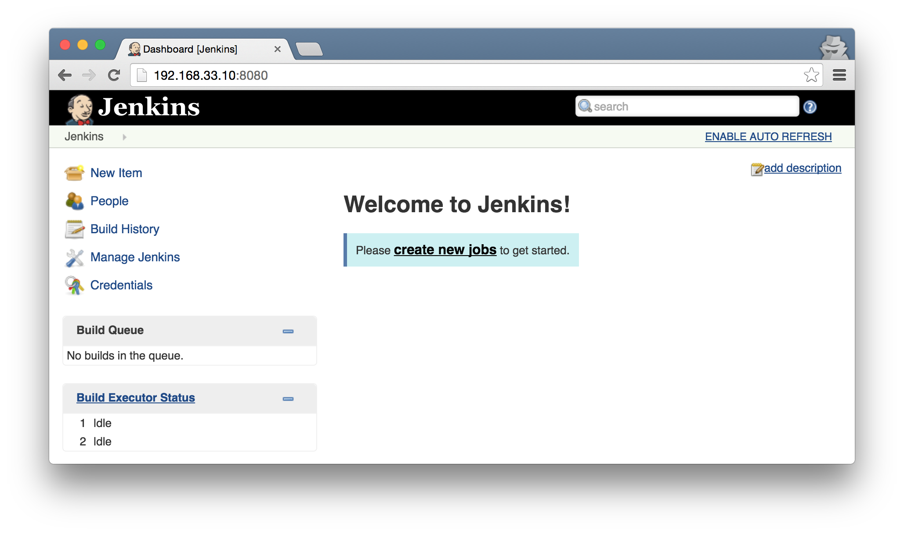

# Jenkins

Jenkins is an award-winning, cross-platform, **continuous integration** and **continuous delivery** application that increases your productivity. Use Jenkins to build and test your software projects continuously making it easier for developers to integrate changes to the project, and making it easier for users to obtain a fresh build. It also allows you to continuously deliver your software by providing powerful ways to define your build pipelines and integrating with a large number of testing and deployment technologies. - 摘錄 [Jenkins](https://wiki.jenkins-ci.org/display/JENKINS/Meet+Jenkins) 官網介紹

## 安裝

參考: https://wiki.jenkins-ci.org/display/JENKINS/Installing+Jenkins+on+Ubuntu

依照官網說明安裝 Jenkins 非常簡單
```shell
$ wget -q -O - https://jenkins-ci.org/debian/jenkins-ci.org.key | sudo apt-key add -
$ sudo sh -c 'echo deb http://pkg.jenkins-ci.org/debian-stable binary/ > /etc/apt/sources.list.d/jenkins.list'
$ sudo apt-get update
$ sudo apt-get install jenkins
```

安裝完後，Jenkins 預設已經啟動
```shell
$ ps aux | grep jenkins
jenkins  10670  0.0  0.0  18596   172 ?        S    16:27   0:00 /usr/bin/daemon --name=jenkins --inherit --env=JENKINS_HOME=/var/lib/jenkins --output=/var/log/jenkins/jenkins.log --pidfile=/var/run/jenkins/jenkins.pid -- /usr/bin/java -Djava.awt.headless=true -jar /usr/share/jenkins/jenkins.war --webroot=/var/cache/jenkins/war --httpPort=8080 --ajp13Port=-1
jenkins  10671  9.9 35.4 1186188 179532 ?      Sl   16:27   0:34 /usr/bin/java -Djava.awt.headless=true -jar /usr/share/jenkins/jenkins.war --webroot=/var/cache/jenkins/war --httpPort=8080 --ajp13Port=-1
vagrant  10752  0.0  0.4  12720  2124 pts/1    S+   16:33   0:00 grep --color=auto jenkins
```

手動設定 Jenkins 服務
```shell
$ sudo service jenkins start        # 啟動
$ sudo service jenkins stop         # 停止
$ sudo service jenkins restart      # 重新啟動
```

## 啟動與存取

參考: https://wiki.jenkins-ci.org/display/JENKINS/Starting+and+Accessing+Jenkins

啟動 Jenkins 最簡單的方式
```shell
$ java -jar jenkins.war
```

打開瀏覽器，開啟 http://192.168.33.10:8080/ (192.168.33.10 是[虛擬機](environment.md)的IP)，就能看到管理介面

### 變更語言

啟動 Jenkins 後，因為瀏覽器語系關係為顯示為中文操作介面，想改成與官網說明一樣的英文介面，依照下面步驟

- 安裝插件：「管理 Jenkins」→「管理外掛程式」→「過濾條件」輸入 `locale` →「下載並於重新啟動後安裝」
- 變更語系：「管理 Jenkins」→「設定系統」→「預設語言」輸入 `en_US` →「Ignore browser preference and force this language to all users」



### Jenkins 功能階層圖
```
Jenkins Home
    |-- Jenkins configure
    |-- Build Jobs
        |-- Job_A
        |   |-- Job Configure
        |   |-- Build History
        |       |-- Build #1
        |       |-- Build #2
        |       |-- Build #3
        |-- Job_B
        |-- Job_C
```

## 實驗一：“Hello World”

### 練習目標

- 在開發環境上
    - 無

- 在 Jenkins Server 上
    - 建立簡單的 Build Job
    - 手動執行 Build Job
    - 自動執行 Build Job (週期性)

### 在 Jenkins Server 上

#### 建立 Build Job

- 到 Jenkins 首頁，點選「New Item」
- 「Item name」填入 `myBuild`，選擇「Freestyle project」，接著進入設定 Build Job 細節頁面
    - 「Build」內按下「Add build step」，選擇「Execute shell」，「Command」填入下面 shell script
    - 按下「Save」儲存離開

```shell
#!/bin/bash
echo "Hello World"
```

#### 手動執行

- 到「myBuild」頁面，點選「Build Now」
- 看到「Build History」出現 Build item，點選 #1
    - 點選「Console Output」，看到以下 Build process

```
Started by user anonymous
Building in workspace /var/lib/jenkins/jobs/myProject/workspace
[workspace] $ /bin/bash /tmp/hudson6372466822262253605.sh
Hello World
Finished: SUCCESS
```

#### 自動執行

- 到「myBuild」頁面，點選「Configure」
    - 「Build Triggers」下點選「Build periodically」，「Schedule」填入 `* * * * *` (表示每分鐘 build 一次)
    - 按下「Save」儲存離開
- 等待數分鐘，看到「Build History」出現多個 Build item

## 實驗二：配合 SCM 進行自動化建置

Jenkins 能根據 Source Code Management (SCM) 上程式碼的變化觸發建置與測試，除了預設的 CVS 還有許多 plugin 支援各式各樣的版本控制系統，如 Accurev, Bazaar, BitKeeper, ClearCase, CMVC, Dimensions, Git, CA Harvest, Mercurial, Perforce, PVCS, StarTeam, CM/Synergy, Microsoft Team Foundation Server, and even Visual SourceSafe。 (資料來源[Jenkins: The Definitive Guide](https://www.safaribooksonline.com/library/view/jenkins-the-definitive/9781449311155/ch05s04.html))

### 練習目標

- 在開發環境上
    - 建立專案，設定 Git repository

- 在 Jenkins Server 上
    - 安裝 plugin (Git)
    - 隨著 Git repository 更新，進行自動化建置

### 在開發環境上

#### 建立工作目錄

```shell
$ mkdir myWorkspace
$ cd myWorkspace
```

#### 設定 Python 版本

```shell
$ pyenv local 3.5.1
$ python --version
Python 3.5.1
```

#### 建立虛擬環境

```shell
$ pyvenv venv
```

#### 切換虛擬環境

```shell
$ pyvenv venv
$ source venv/bin/activate
(venv) $ pip install --upgrade pip
```

> 出現 (venv) 提示表示目前使用 Python virtualenv，往後範例省略顯示

#### 建立專案目錄

```shell
$ mkdir myProject
$ cd myProject
$ pwd
/home/vagrant/myWorkspace/myProject
```

#### 產生 HelloWorld.py

```shell
$ echo 'print("Hello World")' > HelloWorld.py
$ python HelloWorld.py
Hello World
```

#### 初始化 Git repository

```shell
$ git init
```

#### 將 HelloWorld.py 加入 Git repository

```shell
$ git add .
$ git commit -m "add a python file"
```

### 在 Jenkins Server 上

#### 安裝 Git plugin

- 到 Jenkins 首頁，選擇「Manage Jenkins」
    - 點選「Manage Plugins」，進入設定插件管理頁面
        - 選擇「Available」標籤，「filter」輸入 `Git plugin`
        - 選取「Git plugin」，按下「Install without restart」
        - 等候安裝完成

#### 修改 Build Job

- 到「myBuild」頁面，點選「Configure」
    - 「Source Code Management」下選擇「Git」，「Repository URL」填入 `file:///home/vagrant/myWorkspace/myProject`
    - 「Build Triggers」，取消「Build periodically」，改選取「Poll SCM」，「Schedule」填入 `* * * * *` (表示每分鐘查詢 git repository 一次，如果 git repository 有更新則觸發 Build Job)
    - 「Build」下「Execute shell」，「Command」改成下面 shell script
    - 按下「Save」儲存離開

```shell
#!/bin/bash
python --version
python HelloWorld.py
```

如果 git repository 在 Jenkins Server 上從未建置過、或有任何更新產生，會在一分鐘內看到自動執行的 Build result

```shell
Started by an SCM change
Building in workspace /var/lib/jenkins/jobs/myProject/workspace
Cloning the remote Git repository
Cloning repository file:///home/vagrant/myWorkspace/myProject
 > git init /var/lib/jenkins/jobs/myProject/workspace # timeout=10
Fetching upstream changes from file:///home/vagrant/myWorkspace/myProject
 > git --version # timeout=10
 > git -c core.askpass=true fetch --tags --progress file:///home/vagrant/myWorkspace/myProject +refs/heads/*:refs/remotes/origin/*
 > git config remote.origin.url file:///home/vagrant/myWorkspace/myProject # timeout=10
 > git config --add remote.origin.fetch +refs/heads/*:refs/remotes/origin/* # timeout=10
 > git config remote.origin.url file:///home/vagrant/myWorkspace/myProject # timeout=10
Fetching upstream changes from file:///home/vagrant/myWorkspace/myProject
 > git -c core.askpass=true fetch --tags --progress file:///home/vagrant/myWorkspace/myProject +refs/heads/*:refs/remotes/origin/*
 > git rev-parse refs/remotes/origin/master^{commit} # timeout=10
 > git rev-parse refs/remotes/origin/origin/master^{commit} # timeout=10
Checking out Revision 8e045c06247802b5d08f757c0a9fe467a3700424 (refs/remotes/origin/master)
 > git config core.sparsecheckout # timeout=10
 > git checkout -f 8e045c06247802b5d08f757c0a9fe467a3700424
First time build. Skipping changelog.
[workspace] $ /bin/bash /tmp/hudson105525603757121577.sh
Python 2.7.9
Hello World
Finished: SUCCESS
```

雖然建置成功，但是 `python --version` 顯示 Python 2.7.9，跟開發環境使用的版本 Python 3.5.1 不同。接下來要讓 Jenkins Server 的執行環境跟開發環境保持一致。

## 實驗三：設定環境

### 練習目標

- 在開發環境上
    - 無

- 在 Jenkins Server 上
    - 安裝 plugin (pyenv)
    - 設定 Build environment

### 在 Jenkins Server 上

#### 安裝 pyenv plugin

- 到 Jenkins 首頁，選擇「Manage Jenkins」
    - 點選「Manage Plugins」，進入設定插件管理頁面
        - 選擇「Available」標籤，「filter」輸入 `pyenv plugin`
        - 選取「Git plugin」，按下「Install without restart」
        - 等候安裝完成

> 我的經驗：安裝 pvenv plugin 後要重新啟動 jenkins，這個 plugin 才會生效

#### 修改 Build Job

- 到「myBuild」頁面，點選「Configure」
    - 「Build Environment」內選取「pyenv build wrapper」，「The Python version」填寫 `3.5.1`
    - 按下「Save」儲存離開

修改 myBuild Configure，不會觸發 Build Job，手動執行後觀察結果

- 到「myBuild」頁面，點選「Build Now」
- 看到「Build History」出現 Build item，點選最新的 Build result
    - 點選「Console Output」，看到以下 Build process

```
... (略)
Python 3.5.1
Hello World
Finished: SUCCESS
```

除了執行程式，Jenkins 還可以將自動執行單元測試。接下來看看 Jenkins 怎麼將瑣碎的手動步驟變成自動化。

## 實驗四：自動化單元測試

### 練習目標

- 在開發環境上
    - 建立一個 Arithmetic 類別與單元測試
    - 手動執行測試

- 在 Jenkins Server 上
    - 設定自動化測試

### 在開發環境上

#### 新增檔案 Arithmetic.py

```python
def add(a, b):
    return a + b

def subtract(a, b):
    return a - b

def multiply(a, b):
    return a * b

def divide(a, b):
    return a / b

##############################################
# Unittest

import unittest

class TestArithmetic(unittest.TestCase):

    def testAdd(self):
        self.assertEqual(add(1, 1), 2)

    def test_subtract(self):
        self.assertEqual(subtract(5, 2), 3)

    def test_multiply(self):
        self.assertEqual(multiply(3, 2), 6)

    def test_divide(self):
        self.assertEqual(divide(3.0, 2), 1.5)
```

#### 手動測試

```shell
$ python -m unittest -v Arithmetic.py
testAdd (Arithmetic.TestArithmetic) ... ok
test_divide (Arithmetic.TestArithmetic) ... ok
test_multiply (Arithmetic.TestArithmetic) ... ok
test_subtract (Arithmetic.TestArithmetic) ... ok

----------------------------------------------------------------------
Ran 4 tests in 0.003s

OK
```

> 非常重要的原則：檔案進 SCM 前，一定要確定程式碼可以編譯成功，單元測試可以順利通過

#### 新增檔案 .gitignore

.gitignore 可以避免不必要的資料提交到 git repository，例如編譯中間檔、資料庫、密碼等等。目前先略過 Python cache data

```
__pycache__
```

#### 提交程式碼

```shell
$ git add .
$ git commit -m "add Arithmetic with unittest"
```

### 在 Jenkins Server 上

#### 修改 Build Job

- 到「myBuild」頁面，點選「Configure」
    - 「Build」下「Execute shell」，「Command」改成下面 shell script
    - 按下「Save」儲存離開

```shell
#!/bin/bash
python -m unittest -v *.py
```

修改 myBuild Configure，不會觸發 Build Job，手動執行後觀察結果

- 到「myBuild」頁面，點選「Build Now」
- 看到「Build History」出現 Build item，點選最新的 Build result
    - 點選「Console Output」，看到以下 Build process

```
... (略)
testAdd (Arithmetic.TestArithmetic) ... ok
test_divide (Arithmetic.TestArithmetic) ... ok
test_multiply (Arithmetic.TestArithmetic) ... ok
test_subtract (Arithmetic.TestArithmetic) ... ok

----------------------------------------------------------------------
Ran 4 tests in 0.000s

OK
Hello World
Finished: SUCCESS
```

使用 `python -m unittest *.py` 執行單元測試太過土砲，接下來改用正式的執行方式，順便導入一些靜態檢查的工具。

## 實驗五：自動化測試工具

### 練習目標

- 在開發環境上
    - 使用 pip 安裝 [coverage](http://nedbatchelder.com/code/coverage/), [nose](https://nose.readthedocs.org/), [pylint](http://www.pylint.org/) 套件
    - 使用 coverage 產生程式碼覆蓋率的分析報告
    - 使用 nosetest 運行單元測試
    - 使用 pylint 產生程式碼質量的分析報告
    - 提交 Python 套件相依清單到 git repository

- 在 Jenkins Server 上
    - 以 jenkins 使用者身份安裝 virtualenv
    - 設定自動化測試工具

### 在開發環境上

#### 安裝套件

```shell
$ pip install coverage nose pylint
```

#### 運行單元測試

```shell
$ nosetests --with-xunit --all-modules --traverse-namespace --with-coverage --cover-package=. --cover-inclusive
....
Name            Stmts   Miss  Cover
-----------------------------------
Arithmetic.py      18      0   100%
HelloWorld.py       1      0   100%
-----------------------------------
TOTAL              19      0   100%
----------------------------------------------------------------------
Ran 4 tests in 0.009s

OK
```
- 產生分析報告 nosetests.xml

#### 檢查程式碼覆蓋率

```shell
$ python -m coverage xml --include=*
```
- 產生分析報告 coverage.xml

#### 檢查程式碼質量

```shell
$ pylint -f parseable *.py | tee pylint.out
...(略)

Report
======
19 statements analysed.

Statistics by type
------------------

+---------+-------+-----------+-----------+------------+---------+
|type     |number |old number |difference |%documented |%badname |
+=========+=======+===========+===========+============+=========+
|module   |2      |2          |=          |0.00        |0.00     |
+---------+-------+-----------+-----------+------------+---------+
|class    |1      |1          |=          |0.00        |0.00     |
+---------+-------+-----------+-----------+------------+---------+
|method   |4      |4          |=          |0.00        |25.00    |
+---------+-------+-----------+-----------+------------+---------+
|function |4      |4          |=          |0.00        |0.00     |
+---------+-------+-----------+-----------+------------+---------+

...(略)
```
- 產生分析報告 pylint.out

#### 匯出套件相依列表

```shell
$ pip freeze > requirements.txt
```

requirements.txt 內容:
```
astroid==1.4.6
colorama==0.3.7
coverage==4.1
lazy-object-proxy==1.2.2
nose==1.3.7
pylint==1.5.6
six==1.10.0
wrapt==1.10.8
```

#### 修改 .gitignore

```
__pycache__
.coverage
coverage.xml
nosetests.xml
pylint.out
```

#### 提交相依列表

```shell
$ git add .
$ git commit -m "add requirements for pip"
```
### 在 Jenkins Server 上

要在 Jenkins Server 執行開發環境相同的任務 ([coverage](http://nedbatchelder.com/code/coverage/), [nose](https://nose.readthedocs.org/), [pylint](http://www.pylint.org/))，也要安裝相同的虛擬環境。

#### 設定 jenkins 環境

- 以 jenkins 身份登入系統
- 設定環境，[安裝 pyenv、virtualenv](environment.md#安裝-pyenvvirtualenv)

```shell
$ sudo su jenkins -l
$ git clone https://github.com/yyuu/pyenv.git ~/.pyenv
$ git clone https://github.com/yyuu/pyenv-virtualenv.git ~/.pyenv/plugins/pyenv-virtualenv
```

#### 修改 Build Job

- 到「myBuild」頁面，點選「Configure」
    - 「Build」下「Execute shell」，「Command」改成下面 shell script
    - 按下「Save」儲存離開

```shell
PATH=$WORKSPACE/venv/bin:/usr/local/bin:$PATH

nosetests --with-xunit --all-modules --traverse-namespace --with-coverage --cover-package=. --cover-inclusive
python -m coverage xml --include=*
pylint -f parseable *.py | tee pylint.out
```

- 到「myBuild」頁面，點選「Configure」
    - 「Build」內按下「Add build step」，選擇「Execute shell」，「Command」填入下面 shell script
    - 將這個 「Execute shell」移動到「Build」區塊最上面
    - 按下「Save」儲存離開

```shell
PATH=$WORKSPACE/venv/bin:/usr/local/bin:$PATH

if [ ! -d "venv" ]; then
        virtualenv venv
fi
. venv/bin/activate
pip install -r requirements.txt
```

> 上面這段 script 主要目的是設定 python 虛擬環境，並且安裝開發環境需要的 python 套件

修改 myBuild Configure，不會觸發 Build Job，手動執行後觀察結果

- 到「myBuild」頁面，點選「Build Now」
- 看到「Build History」出現 Build item，點選最新的 Build result
    - 點選「Console Output」，看到以下 Build process

Jenkins Console Output 的內容就是手動執行的結果，雖然詳細但可讀性非常差。接下來在 Jenkins Server 上加入一些 plugin，讓結果可以用圖形方式呈現。

## 實驗六：圖形化測試結果

### 練習目標

- 在 Jenkins Server 上
    - 安裝 [Cobertura plugin](https://wiki.jenkins-ci.org/display/JENKINS/Cobertura+Plugin) (用来顯示程式碼覆蓋率)
    - 安裝 [Violations plugin](https://wiki.jenkins-ci.org/display/JENKINS/Violations) (用來顯示程式碼是否合乎規範)
    - 設定 Post-build Actions，產生圖形結果

### 在 Jenkins Server 上

#### 安裝 Cobertura plugin

- 到 Jenkins 首頁，選擇「Manage Jenkins」
- 點選「Manage Plugins」，進入設定插件管理頁面
- 選擇「Available」標籤，「filter」輸入 `Cobertura plugin`
- 選取「Cobertura plugin」，按下「Install without restart」
- 等候安裝完成

#### 安裝 Violations plugin

- 到 Jenkins 首頁，選擇「Manage Jenkins」
- 點選「Manage Plugins」，進入設定插件管理頁面
- 選擇「Available」標籤，「filter」輸入 `Violations plugin`
- 選取「Violations plugin」，按下「Install without restart」
- 等候安裝完成

#### 修改 Build Job

- 到「myBuild」頁面，點選「Build Now」
    - 「Post-build Actions」下點選「Publish Cobertura Coverage Report」，「Cobertura xml report pattern」填入 `coverage.xml`
    - 「Post-build Actions」下點選「Publish JUnit test result report」，「Test report XMLs」填入 `nosetests.xml`
    - 「Post-build Actions」下點選「Report Violations」，「pylint」填入 `pylint.out`
    - 按下「Save」儲存離開

修改 myBuild Configure，不會觸發 Build Job，手動執行後觀察結果

- 到「myBuild」頁面，點選「Build Now」
- 看到「Build History」出現 Build item，點選最新的 Build result
    - 點選「Console Output」，看到以下 Build process
- 到「myBuild」頁面，點選「Coverage Report」，觀察圖形分析報告
- 到「myBuild」頁面，點選「Violations」，觀察圖形分析報告


----
## 參考
- [Using Jenkins](https://wiki.jenkins-ci.org/display/JENKINS/Use+Jenkins) - Jenkins 官網文件
- [CI (Continuous integration) 關鍵技術：使用 Jenkins](http://www.books.com.tw/products/0010596579) - 偏重 Android App 開發
- [持續整合與自動化測試 - 使用 Jenkins 與 Docker 進行課程實作](https://www.gitbook.com/book/smlsunxie/jenkins-workshop/details) - 內容較完整
- [Jenkins CI 實戰手冊](http://jenkins.readbook.tw/) - 內容不完整
- [Jenkins CI 從入門到實戰講座](http://trunk-studio.kktix.cc/events/jenkins-2016001) - 送電子書，內有詳盡的實作步驟說明
- [Python Projects](https://wiki.jenkins-ci.org/display/JENKINS/Python+Projects) - Using Jenkins for Python Projects
- Automated python unit testing, code coverage and code quality analysis with Jenkins - [part 1](http://bhfsteve.blogspot.tw/2012/04/automated-python-unit-testing-code.html), [part 2](http://bhfsteve.blogspot.tw/2012/04/automated-python-unit-testing-code_20.html), [part 3](http://bhfsteve.blogspot.tw/2012/04/automated-python-unit-testing-code_27.html)
- [基于 Jenkins 的 Python 代码集成整合](http://yumminhuang.github.io/blog/2015/04/17/%E5%9F%BA%E4%BA%8E-jenkins-%E7%9A%84-python-%E4%BB%A3%E7%A0%81%E9%9B%86%E6%88%90%E6%95%B4%E5%90%88/)
- [jenkins集成python的单元测试](http://www.mamicode.com/info-detail-1383168.html)
- [Making Jenkins Work With Python's Virtualenv](http://iamnearlythere.com/jenkins-python-virtualenv/)
